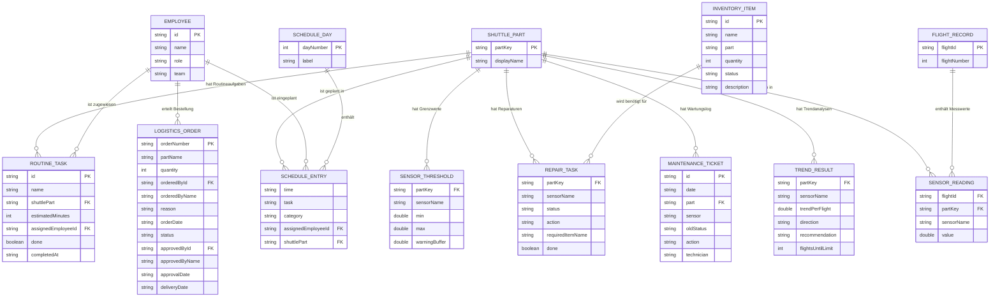

# ER-Diagramm — Shuttle Dashboard

**Gruppe 5 · Datenmodell**

> Dargestellt: alle persistenten Entitäten des Domänenmodells mit ihren Schlüsselattributen und Beziehungen.

---

```mermaid
erDiagram

    EMPLOYEE {
        string id PK
        string name
        string role
        string team
    }

    SHUTTLE_PART {
        string partKey PK
        string displayName
    }

    SENSOR_THRESHOLD {
        string partKey FK
        string sensorName
        double min
        double max
        double warningBuffer
    }

    FLIGHT_RECORD {
        string flightId PK
        int flightNumber
    }

    SENSOR_READING {
        string flightId FK
        string partKey FK
        string sensorName
        double value
    }

    REPAIR_TASK {
        string partKey FK
        string sensorName
        string status
        string action
        string requiredItemName
        boolean done
    }

    INVENTORY_ITEM {
        string id PK
        string name
        string part
        int quantity
        string status
        string description
    }

    LOGISTICS_ORDER {
        string orderNumber PK
        string partName
        int quantity
        string orderedById FK
        string orderedByName
        string reason
        string orderDate
        string status
        string approvedById FK
        string approvedByName
        string approvalDate
        string deliveryDate
    }

    MAINTENANCE_TICKET {
        string id PK
        string date
        string part FK
        string sensor
        string oldStatus
        string action
        string technician
    }

    ROUTINE_TASK {
        string id PK
        string name
        string shuttlePart FK
        int estimatedMinutes
        string assignedEmployeeId FK
        boolean done
        string completedAt
    }

    SCHEDULE_DAY {
        int dayNumber PK
        string label
    }

    SCHEDULE_ENTRY {
        string time
        string task
        string category
        string assignedEmployeeId FK
        string shuttlePart FK
    }

    TREND_RESULT {
        string partKey FK
        string sensorName
        double trendPerFlight
        string direction
        string recommendation
        int flightsUntilLimit
    }

    SHUTTLE_PART ||--o{ SENSOR_THRESHOLD    : "hat Grenzwerte"
    SHUTTLE_PART ||--o{ REPAIR_TASK         : "hat Reparaturen"
    SHUTTLE_PART ||--o{ MAINTENANCE_TICKET  : "hat Wartungslog"
    SHUTTLE_PART ||--o{ ROUTINE_TASK        : "hat Routineaufgaben"
    SHUTTLE_PART ||--o{ SCHEDULE_ENTRY      : "ist geplant in"
    SHUTTLE_PART ||--o{ TREND_RESULT        : "hat Trendanalysen"
    SHUTTLE_PART ||--o{ SENSOR_READING      : "wird gemessen in"

    FLIGHT_RECORD ||--o{ SENSOR_READING     : "enthält Messwerte"

    INVENTORY_ITEM ||--o{ REPAIR_TASK       : "wird benötigt für"

    EMPLOYEE ||--o{ ROUTINE_TASK            : "ist zugewiesen"
    EMPLOYEE ||--o{ LOGISTICS_ORDER         : "erteilt Bestellung"
    EMPLOYEE ||--o{ SCHEDULE_ENTRY          : "ist eingeplant"

    SCHEDULE_DAY ||--o{ SCHEDULE_ENTRY      : "enthält"
```
