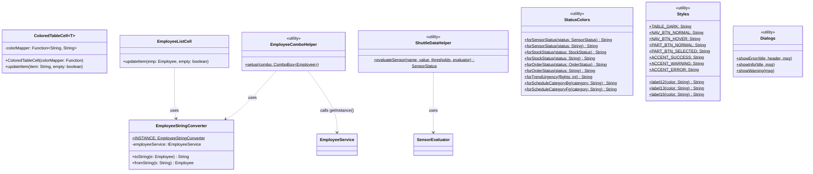
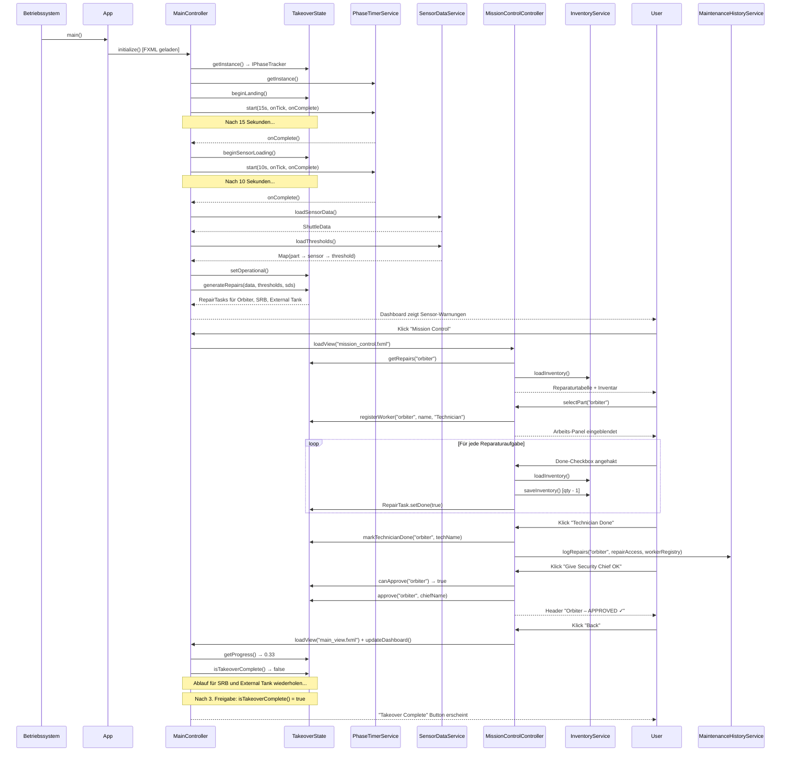
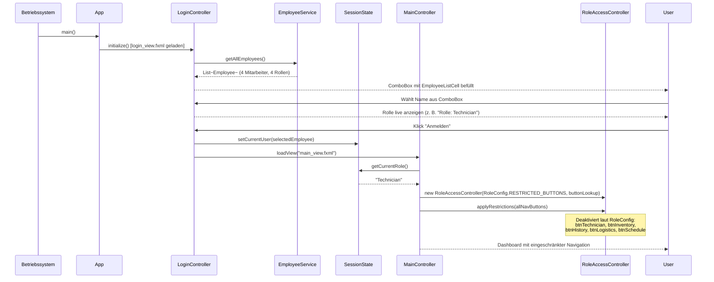

# Shuttle Dashboard — Technische Dokumentation

**Gruppe 5 · Java/JavaFX Projekt**

---

## 1. Projektübersicht

Das Shuttle Dashboard ist eine JavaFX-Anwendung zur Steuerung und Überwachung des Übergabeprozesses einer Raumfähre. Es simuliert den vollständigen Ablauf nach der Landung: von der Sensor-Kalibrierung über die Reparatur defekter Komponenten bis zur Freigabe durch den Security Chief.

### Kernfunktionen

| Funktion | Beschreibung |
|---|---|
| **Login** | Demo-Anmeldung per Namensauswahl; Rolle steuert Sichtbarkeit der Navigation |
| **Phasenverwaltung** | Automatischer Ablauf: Landing → Sensor Loading → Operational |
| **Mission Control** | Reparaturaufgaben pro Shuttle-Teil, Technikerzuweisung, Freigabe |
| **Logistics** | Bestellworkflow mit Genehmigung durch Security Chief |
| **Predictive Analysis** | Trendauswertung über 5 Flughistorien; Frühwarnsystem |
| **Schedule** | Interaktiver 3-Tage-Übergabeplan mit Umplanungsfunktion |
| **Staff** | Mitarbeiterverwaltung und Teamübersicht |
| **Inventory** | Lagerbestandsanzeige mit Statusfarbkodierung |
| **History** | Protokoll abgeschlossener Wartungstickets |

### Tech Stack

| Komponente | Version |
|---|---|
| Java | 17 |
| JavaFX | 21.0.2 |
| Build-Tool | Maven |
| UI-Definition | FXML |

### Einstiegspunkt

```
Main.java → App.java → login_view.fxml → LoginController → main_view.fxml → MainController
```

---

## 2. Architektur

### Architekturmuster: MVC

Die Anwendung folgt dem **Model-View-Controller**-Muster mit strikter Schichtentrennung:

- **Model** (`model/`): Plain Java Objects (POJOs) und Enums — keine Logik, nur Daten und JavaFX-Properties
- **View** (`resources/view/*.fxml`): Deklarative UI-Definitionen in FXML
- **Controller** (`controller/`): Verbinden UI-Events mit Services; keine Datenzugriffslogik
- **Service** (`service/`): Geschäftslogik, Datenzugriff; alle zustandsbehafteten Services als Singletons

### Package-Struktur

| Package | Klassen / Interfaces | Verantwortlichkeit |
|---|---|---|
| `com.group5.shuttle` | 2 Klassen | App-Einstieg (`Main`, `App`) |
| `controller` | 20 Klassen | UI-Logik, Event-Handling, Panel-Controller, Helper |
| `service` | 24 Klassen + 12 Interfaces | Geschäftslogik, Datenzugriff, statische Helfer |
| `model` | 17 Klassen + 5 Enums | Datenmodell (POJOs, JavaFX-Properties, Enums) |
| `util` | 8 Klassen | Querschnittsthemen (Farben, Konverter, Tabellenzellen) |

### Verwendete Entwurfsmuster

**Singleton**
Alle zustandsbehafteten Services halten genau eine Instanz über die gesamte Sitzung. Implementiert mit Holder-Klasse oder einfacher statischer Instanz:
`TakeoverState`, `SessionState`, `EmployeeService`, `InventoryService`, `SensorDataService`, `ScheduleService`, `FlightHistoryService`, `PhaseTimerService`, `TicketStore`, `OrderStore`, `RoutineTaskStore`

**Template Method**
`BaseController` definiert `loadView(fxml)` als Template: `getNavigationButton()` ist abstrakt — Subklassen liefern den konkreten Button, damit `loadView` das aktive Fenster findet. `setupBackButton(btn)` kapselt das Back-Button-Muster:

```java
// BaseController (abstrakte Vorlage)
protected void loadView(String fxml) {
    Parent root = new FXMLLoader(...).load();
    Stage stage = (Stage) getNavigationButton().getScene().getWindow();
    stage.getScene().setRoot(root);
}
protected void setupBackButton(Button btn) {
    btn.setOnAction(e -> loadView("main_view.fxml"));
}

// Subklasse (konkrete Implementierung)
@Override protected Button getNavigationButton() { return btnBack; }
```

**Strategy**
`ColoredTableCell` ist der Context; er nimmt eine `Function<String, String>` als Strategie. `StatusColors` liefert die konkreten Strategien für Sensor-, Lager- und Bestellstatus:

```java
new ColoredTableCell<>(StatusColors::forSensorStatus)
new ColoredTableCell<>(StatusColors::forStockStatus)
new ColoredTableCell<>(StatusColors::forOrderStatus)
```

**Observer (JavaFX Properties)**
`RepairTask` und `LogisticsOrder` verwenden JavaFX Properties (`SimpleBooleanProperty`, `SimpleStringProperty`), damit Tabellenzeilen sich automatisch aktualisieren, wenn sich der Zustand ändert:

```java
private final BooleanProperty done       = new SimpleBooleanProperty(false);
private final StringProperty  partStatus = new SimpleStringProperty("NONE");
```

**Enum-carried Metadata (OCP)**
Enums tragen fachliche Metadaten (Farbe, Label, Stil), sodass switch-Anweisungen entfallen. Neue Ausprägung = ein neuer Enum-Eintrag:

```java
enum ScheduleStatus {
    ON_TIME(Styles.ACCENT_SUCCESS, "On Schedule", "#66ff66"),
    HOURS_BEHIND(Styles.ACCENT_WARNING, "Behind Schedule", "#ffcc00"),
    DAY_BEHIND(Styles.ACCENT_ERROR, "1+ Day Behind", "#ff4444");
    // ...
}
```

---

## 3. UML Klassendiagramm

### 3a. Controller-Hierarchie

```mermaid
classDiagram
    class BaseController {
        <<abstract>>
        #getNavigationButton()* Button
        #setupBackButton(btn: Button)
        #loadView(fxml: String)
    }

    class LoginController {
        -employeeService: EmployeeService
        +initialize()
        +handleLogin()
    }

    class MainController {
        -sensorService: ISensorDataService
        -scheduleService: IScheduleService
        -phaseTracker: IPhaseTracker
        -partApproval: IPartApproval
        -takeoverProgress: ITakeoverProgress
        -workerReg: IWorkerRegistry
        -repairAccess: IRepairAccess
        -predictiveService: IPredictiveAnalysisService
        +initialize()
        +updateDashboard()
    }

    class MissionControlController {
        -workerRegistry: IWorkerRegistry
        -repairAccess: IRepairAccess
        -partApproval: IPartApproval
        -inventoryService: IInventoryService
        -scheduleService: IScheduleService
        -partButtons: Map~String, Button~
        +initialize()
    }

    class TechnicianController {
        -sensorService: ISensorDataService
        +initialize()
    }

    class HistoryController {
        -ticketStore: TicketStore
        +initialize()
    }

    class InventoryController {
        -inventoryService: InventoryService
        +initialize()
    }

    class LogisticsController {
        -inventoryService: IInventoryService
        -employeeService: IEmployeeService
        +initialize()
    }

    class ScheduleController {
        -scheduleService: IScheduleService
        +initialize()
    }

    class StaffController {
        -workerRegistry: IWorkerRegistry
        -repairAccess: IRepairAccess
        +initialize()
    }

    BaseController <|-- MainController
    BaseController <|-- MissionControlController
    BaseController <|-- TechnicianController
    BaseController <|-- HistoryController
    BaseController <|-- InventoryController
    BaseController <|-- LogisticsController
    BaseController <|-- ScheduleController
    BaseController <|-- StaffController

    class SensorPanelController {
        -sensorService: SensorEvaluator
        -partApproval: IPartApproval
        +update(data: ShuttleData, thresholds: Map)
    }

    class SchedulePanelController {
        -scheduleService: IScheduleService
        -employeeService: IEmployeeService
        +update()
    }

    class PredictivePanelController {
        -predictiveService: IPredictiveAnalysisService
        +update()
    }

    class InventoryStatusPanelController {
        -inventoryService: IInventoryService
        +update(displayName: String)
    }

    class AiChatController {
        +setContext(role: String)
        +handleInput()
    }

    class RoleAccessController {
        -restrictionIds: Map~String, List~
        -buttonLookup: Map~String, Button~
        +applyRestrictions(allNavButtons: List)
    }

    class RoleConfig {
        <<utility>>
        +RESTRICTED_BUTTONS: Map$
    }

    class RoutineTableHelper {
        <<utility>>
        +setup(table, colName, colDone, colTime)$
        +setup(table, colName, colEst, colDone, colTime)$
    }

    class PartStatusCell {
        +updateItem(status: String, empty: boolean)
    }

    class SensorStatusCell {
        +updateItem(item: String, empty: boolean)
    }

    MainController --> SensorPanelController : creates
    MainController --> SchedulePanelController : creates
    MainController --> PredictivePanelController : creates
    MainController --> AiChatController : creates
    MainController --> RoleAccessController : creates
    RoleAccessController ..> RoleConfig : reads
    MissionControlController --> InventoryStatusPanelController : creates
    MissionControlController ..> RoutineTableHelper : uses
    StaffController ..> RoutineTableHelper : uses
    AiChatController ..> AiAdvisorService : calls (nicht aktiv genutzt)
```



### 3b. Service-Interfaces und Implementierungen

```mermaid
classDiagram
    class SensorEvaluator {
        <<interface>>
        +evaluate(value: double, threshold: SensorThreshold) SensorStatus
    }

    class ISensorDataService {
        <<interface>>
        +loadSensorData() ShuttleData
        +loadThresholds() Map
    }

    class IEmployeeService {
        <<interface>>
        +getAllEmployees() List~Employee~
        +getById(id: String) Optional~Employee~
        +getByRole(role: String) List~Employee~
        +getByTeam(team: String) List~Employee~
    }

    class IInventoryService {
        <<interface>>
        +loadInventory() List~InventoryItem~
        +saveInventory(items: List)
    }

    class IScheduleService {
        <<interface>>
        +loadSchedule() TakeoverSchedule
    }

    class IFlightHistoryService {
        <<interface>>
        +loadFlightHistory() FlightHistory
    }

    class IPredictiveAnalysisService {
        <<interface>>
        +analyzeAll() Map~String, List~TrendResult~~
    }

    class IPartApproval {
        <<interface>>
        +isPartApproved(partKey: String) boolean
        +canApprove(partKey: String) boolean
        +approve(partKey: String, chiefName: String)
    }

    class IRepairAccess {
        <<interface>>
        +getRepairs(partKey: String) List~RepairTask~
        +allRepairsDone(partKey: String) boolean
        +isTechnicianDone(partKey: String) boolean
        +markTechnicianDone(partKey: String, techName: String)
        +generateRepairs(data, thresholds, evaluator)
    }

    class ITakeoverProgress {
        <<interface>>
        +getProgress() double
        +isTakeoverComplete() boolean
        +getLastActivity() String
    }

    class IWorkerRegistry {
        <<interface>>
        +registerWorker(partKey, name, role)
        +getWorkerInfo(partKey: String) String
        +getTechnicianName(partKey: String) String
        +getSecurityChiefName(partKey: String) String
    }

    class IPhaseTracker {
        <<interface>>
        +getAppPhase() AppPhase
        +getRemainingSeconds() int
        +getSimulatedHoursElapsed() double
        +getScheduleStatus() ScheduleStatus
        +beginLanding()
        +beginSensorLoading()
        +setOperational()
        +reset()
    }

    ISensorDataService --|> SensorEvaluator

    class TakeoverState {
        <<Singleton>>
        +PART_KEYS: String[]$
        +getInstance()$ TakeoverState
        +getDisplayName(partKey: String)$ String
    }

    class EmployeeService {
        <<Singleton>>
        +getInstance()$ EmployeeService
    }

    class SensorDataService {
        <<Singleton>>
        +getInstance()$ SensorDataService
    }

    class InventoryService {
        <<Singleton>>
        +getInstance()$ InventoryService
    }

    class ScheduleService {
        <<Singleton>>
        +getInstance()$ ScheduleService
    }

    class FlightHistoryService {
        <<Singleton>>
        +getInstance()$ FlightHistoryService
    }

    class PredictiveAnalysisService {
        -flightHistoryService: IFlightHistoryService
        -sensorDataService: ISensorDataService
        +analyzeAll() Map
    }

    TakeoverState ..|> IWorkerRegistry
    TakeoverState ..|> IRepairAccess
    TakeoverState ..|> IPartApproval
    TakeoverState ..|> ITakeoverProgress
    TakeoverState ..|> IPhaseTracker
    EmployeeService ..|> IEmployeeService
    SensorDataService ..|> ISensorDataService
    InventoryService ..|> IInventoryService
    ScheduleService ..|> IScheduleService
    FlightHistoryService ..|> IFlightHistoryService
    PredictiveAnalysisService ..|> IPredictiveAnalysisService

    PredictiveAnalysisService --> IFlightHistoryService
    PredictiveAnalysisService --> ISensorDataService

    class AbstractStore~T~ {
        <<abstract>>
        #items: List~T~
        +getAll() List~T~
        +clear()
    }

    class OrderStore {
        <<Singleton>>
        +getInstance()$ OrderStore
        +createOrder(partName, qty, orderedBy, reason) LogisticsOrder
        +getOrders() List~LogisticsOrder~
    }

    class TicketStore {
        <<Singleton>>
        +getInstance()$ TicketStore
        +getTickets() List~MaintenanceTicket~
        +saveTickets(tickets: List)
    }

    AbstractStore <|-- OrderStore
    AbstractStore <|-- TicketStore

    class SessionState {
        <<Singleton>>
        -currentUser: Employee
        +getInstance()$ SessionState
        +setCurrentUser(e: Employee)
        +getCurrentUser() Employee
        +getCurrentRole() String
    }

    class RoutineTaskStore {
        <<Singleton>>
        +getInstance()$ RoutineTaskStore
        +getTasksForEmployee(empId: String) List
        +getTasksForPart(part: String) List
        +getById(id: String) Optional~RoutineTask~
        +reset()
    }

    class PhaseTimerService {
        <<Singleton>>
        +getInstance()$ PhaseTimerService
        +start(seconds: int, onTick: Consumer, onComplete: Runnable)
        +stop()
    }

    class AiAdvisorService {
        <<utility>>
        +getResponse(message: String)$ String
    }

    class AppPhaseState {
        -appPhase: AppPhase
        -MILESTONES: Map~String, Double~$
        +beginLanding()
        +beginSensorLoading()
        +setOperational()
        +getScheduleStatus(approval: IPartApproval) ScheduleStatus
        +getSimulatedHoursElapsed() double
    }

    TakeoverState *-- AppPhaseState

    class OrderApprovalService {
        <<utility>>
        +approve(order, invService, empService, onDelivered)$
        +reject(order, empService)$
    }

    class OrderDeliveryService {
        <<utility>>
        +DELIVERY_SECONDS: int$
        +scheduleDelivery(onDelivered: Runnable)$
    }

    class RepairInventoryService {
        <<utility>>
        +initTaskStatuses(tasks, inventoryService)$
        +placeOrder(task, inventoryService, onArrived)$
        +deductInventory(task, inventoryService, onDeducted)$
    }

    class RepairPlanningService {
        <<utility>>
        +plan(data, thresholds, evaluator, inventoryService)$ Map
    }

    class MaintenanceHistoryService {
        <<utility>>
        +logRepairs(partKey, repairAccess, workerRegistry)$
    }

    class SensorStatusAggregator {
        <<utility>>
        +findWorstSensorStatus(data, thresholds, evaluator)$ SensorStatus
    }

    class InventoryStatusCalculator {
        <<utility>>
        +calculate(quantity: int)$ StockStatus
    }

    class TrendCalculator {
        <<utility>>
        +computeFlightsUntilLimit(current, trend, threshold)$ int
        +buildRecommendation(sensor, trend, direction, flights)$ String
    }

    class LogisticsOrderService {
        <<utility>>
        +approve(order, chief)$
        +reject(order, chief)$
        +markOrdered(order)$
        +markDelivered(order)$
    }

    TakeoverState ..> RepairPlanningService
    OrderApprovalService ..> OrderDeliveryService
    OrderApprovalService ..> LogisticsOrderService
    RepairInventoryService ..> OrderDeliveryService
```



### 3c. Model-Klassen und Enums

```mermaid
classDiagram
    class Employee {
        -id: String
        -name: String
        -role: String
        -team: String
        +toString() String
    }

    class InventoryItem {
        -id: String
        -name: String
        -part: String
        -quantity: int
        -status: StockStatus
        -description: String
        +setQuantity(qty: int)
        +setStatus(s: StockStatus)
    }

    class LogisticsOrder {
        -orderNumber: String
        -partName: String
        -quantity: int
        -orderedByName: String
        -status: OrderStatus
        -statusProperty: SimpleStringProperty
        +getOrderStatus() OrderStatus
        +setStatus(s: OrderStatus)
        +statusProperty() SimpleStringProperty
    }

    class RepairTask {
        -partKey: String
        -sensorName: SimpleStringProperty
        -status: SimpleStringProperty
        -action: SimpleStringProperty
        -done: SimpleBooleanProperty
        -requiredItemName: String
        -partStatus: SimpleStringProperty
        -partAvailable: SimpleBooleanProperty
        +doneProperty() BooleanProperty
        +partStatusProperty() StringProperty
        +setDone(done: boolean)
        +setPartStatus(s: StockStatus)
    }

    class RoutineTask {
        -id: String
        -name: String
        -shuttlePart: String
        -estimatedMinutes: int
        -assignedEmployeeId: String
        -done: SimpleBooleanProperty
        -completedAt: String
        +doneProperty() BooleanProperty
        +setCompletedAt(ts: String)
    }

    class MaintenanceTicket {
        -date: String
        -part: String
        -sensor: String
        -oldStatus: String
        -action: String
        -technician: String
    }

    class ShuttleData {
        -parts: Map~String, ShuttlePart~
        +getAllParts() Map~String, ShuttlePart~
        +setOrbiter(p: ShuttlePart)
        +setSrb(p: ShuttlePart)
        +setExternalTank(p: ShuttlePart)
    }

    class ShuttlePart {
        -sensors: Map~String, Double~
        +getSensors() Map~String, Double~
        +setSensor(key: String, value: Double)
    }

    class SensorThreshold {
        -min: Double
        -max: Double
        -warningBuffer: double
    }

    class SensorRow {
        -part: SimpleStringProperty
        -sensor: SimpleStringProperty
        -value: SimpleStringProperty
        -status: SimpleStringProperty
    }

    class PartState {
        -technicianName: String
        -securityChiefName: String
        -securityApproved: boolean
        -technicianDone: boolean
        -repairs: List~RepairTask~
        +reset()
    }

    class TrendResult {
        -partKey: String
        -sensorName: String
        -trendPerFlight: double
        -direction: String
        -recommendation: String
        -flightsUntilLimit: int
    }

    class TakeoverSchedule {
        -takeoverTitle: String
        -days: List~ScheduleDay~
    }

    class ScheduleDay {
        -dayNumber: int
        -label: String
        -entries: List~ScheduleEntry~
    }

    class ScheduleEntry {
        -time: String
        -task: String
        -category: String
        -assignedEmployeeId: String
        -shuttlePart: String
        +setAssignedEmployeeId(id: String)
    }

    class FlightHistory {
        -flights: List~FlightRecord~
    }

    class FlightRecord {
        -flightId: String
        -flightNumber: int
        -sensors: Map~String, Map~String, Double~~
    }

    class OrderStatus {
        <<enum>>
        PENDING_APPROVAL
        APPROVED
        REJECTED
        ORDERED
        DELIVERED
        +getColor() String
    }

    class SensorStatus {
        <<enum>>
        OK
        WARNING
        REPLACE
        +getColor() String
    }

    class StockStatus {
        <<enum>>
        NONE
        IN_STOCK
        LOW
        OUT_OF_STOCK
        ORDERED
        ARRIVED
        +getLabel() String
        +getColor() String
        +showsButton() boolean
        +skipsStatusInit() boolean
    }

    class AppPhase {
        <<enum>>
        LANDING
        SENSOR_LOADING
        OPERATIONAL
    }

    class ScheduleStatus {
        <<enum>>
        ON_TIME
        HOURS_BEHIND
        DAY_BEHIND
        +getProgressStyle() String
        +getLabel() String
        +getColor() String
    }

    ShuttleData *-- ShuttlePart
    TakeoverSchedule *-- ScheduleDay
    ScheduleDay *-- ScheduleEntry
    FlightHistory *-- FlightRecord
    PartState *-- RepairTask
    InventoryItem --> StockStatus
    RepairTask --> SensorStatus
    RepairTask --> StockStatus
    LogisticsOrder --> OrderStatus
```



### 3d. Util-Klassen



### 3e. Controller → Service Abhängigkeiten

```mermaid
classDiagram
    class LoginController
    class MainController
    class MissionControlController
    class LogisticsController
    class ScheduleController
    class StaffController
    class TechnicianController
    class SensorPanelController
    class SchedulePanelController
    class PredictivePanelController
    class InventoryStatusPanelController

    class IEmployeeService { <<interface>> }
    class ISensorDataService { <<interface>> }
    class IInventoryService { <<interface>> }
    class IScheduleService { <<interface>> }
    class IPredictiveAnalysisService { <<interface>> }
    class IPartApproval { <<interface>> }
    class IRepairAccess { <<interface>> }
    class ITakeoverProgress { <<interface>> }
    class IWorkerRegistry { <<interface>> }
    class IPhaseTracker { <<interface>> }
    class SensorEvaluator { <<interface>> }

    class SessionState { <<Singleton>> }
    class TakeoverState { <<Singleton>> }
    class EmployeeService { <<Singleton>> }
    class SensorDataService { <<Singleton>> }
    class InventoryService { <<Singleton>> }
    class ScheduleService { <<Singleton>> }
    class PredictiveAnalysisService

    TakeoverState ..|> IPartApproval
    TakeoverState ..|> IRepairAccess
    TakeoverState ..|> ITakeoverProgress
    TakeoverState ..|> IWorkerRegistry
    TakeoverState ..|> IPhaseTracker
    EmployeeService ..|> IEmployeeService
    SensorDataService ..|> ISensorDataService
    SensorDataService ..|> SensorEvaluator
    InventoryService ..|> IInventoryService
    ScheduleService ..|> IScheduleService
    PredictiveAnalysisService ..|> IPredictiveAnalysisService

    LoginController --> IEmployeeService
    LoginController --> SessionState
    MainController --> ISensorDataService
    MainController --> IScheduleService
    MainController --> IPhaseTracker
    MainController --> IPartApproval
    MainController --> ITakeoverProgress
    MainController --> IWorkerRegistry
    MainController --> IRepairAccess
    MainController --> IPredictiveAnalysisService
    MainController --> SessionState
    MissionControlController --> IWorkerRegistry
    MissionControlController --> IRepairAccess
    MissionControlController --> IPartApproval
    MissionControlController --> IInventoryService
    MissionControlController --> IScheduleService
    LogisticsController --> IInventoryService
    LogisticsController --> IEmployeeService
    StaffController --> IWorkerRegistry
    StaffController --> IRepairAccess
    ScheduleController --> IScheduleService
    ScheduleController --> EmployeeService
    TechnicianController --> ISensorDataService
    SensorPanelController --> SensorEvaluator
    SensorPanelController --> IPartApproval
    SchedulePanelController --> IScheduleService
    SchedulePanelController --> IEmployeeService
    PredictivePanelController --> IPredictiveAnalysisService
    InventoryStatusPanelController --> IInventoryService
```



---

## 4. UML Sequenzdiagramm — Takeover-Workflow

Zeigt den vollständigen Ablauf vom App-Start bis zur Freigabe eines Shuttle-Teils durch den Security Chief.



---

## 4b. UML Sequenzdiagramm — Login & Rollenbasierter Zugriff



---

## 5. Programmlogik — Kernprozesse

### 5.1 Login & Rollenbasierter Zugriff

Die Anwendung startet mit einem Demo-Login-Screen. Der Benutzer wählt seinen Namen aus einer ComboBox — alle Mitarbeiter werden über `EmployeeService.getAllEmployees()` geladen und mit `EmployeeListCell` (nutzt `EmployeeStringConverter`) dargestellt.

Nach der Auswahl speichert `SessionState` (Singleton) den eingeloggten Mitarbeiter für die gesamte Sitzung. `MainController` liest die Rolle und delegiert die Button-Sperrung an `RoleAccessController`, der seine Konfiguration aus `RoleConfig.RESTRICTED_BUTTONS` liest (OCP: neue Rolle = ein Eintrag in `RoleConfig`, kein Code ändert sich):

| Rolle | Gesperrte Navigation |
|---|---|
| **Security Chief** | nichts — Vollzugriff |
| **Technician** | Technician-View, Inventory, History, Logistics, Schedule |
| **Planner** | Mission Control, Technician-View, Inventory, History, Logistics |
| **Logistics** | Mission Control, Technician-View, History, Staff, Schedule |

### 5.2 Phasenverwaltung

Die Anwendung durchläuft drei Phasen, gesteuert durch `PhaseTimerService` (JavaFX `Timeline`):

| Phase | Dauer | Beschreibung |
|---|---|---|
| **LANDING** | 15 Sekunden | Shuttle landet; nur Logistics zugänglich |
| **SENSOR_LOADING** | 10 Sekunden | Sensordaten werden simuliert geladen |
| **OPERATIONAL** | Unbegrenzt | Vollbetrieb; Reparaturen können starten |

`AppPhaseState` berechnet simulierte Stunden seit Operational-Start. Anhand von Meilensteinen (`orbiter` = 15 h, `srb` = 38 h, `externalTank` = 40 h) wird der `ScheduleStatus` bestimmt (`ON_TIME`, `HOURS_BEHIND`, `DAY_BEHIND`). Der `ScheduleStatus`-Enum trägt Farbe, Label und CSS-Stil (OCP).

### 5.3 Reparatur-Workflow

```
1. Techniker wählt Teil → System registriert ihn via IWorkerRegistry
2. RepairPlanningService erzeugt RepairTasks aus Sensordaten (WARNING/REPLACE)
3. Pro Aufgabe: Lagerbestand prüfen via IInventoryService
   → IN_STOCK:    Checkbox → Bestand -1 via RepairInventoryService
   → OUT_OF_STOCK: Order → OrderDeliveryService simuliert 10s Lieferung → ARRIVED
4. Alle Aufgaben erledigt → "Technician Done"
   → MaintenanceHistoryService schreibt Tickets in TicketStore
5. Security Chief logt ein → canApprove() = true → "Approve"
   → IPartApproval.approve() → Progress +33%
6. Nach 3 Teilen: ITakeoverProgress.isTakeoverComplete() = true
```

### 5.4 Logistics-Bestellworkflow

```
PENDING_APPROVAL → (Approve) → ORDERED → (10 s Lieferung) → DELIVERED
                 → (Reject)  → REJECTED
```

`OrderApprovalService` delegiert an `LogisticsOrderService` (Status-Update) und `OrderDeliveryService` (10-Sekunden-Timer). Nach Lieferung erhöht `InventoryService` den Lagerbestand automatisch.

### 5.5 Prädiktive Analyse

`PredictiveAnalysisService` (implementiert `IPredictiveAnalysisService`) wertet 5 gespeicherte Flughistorien aus:

1. Für jeden Sensor: Werte der letzten 5 Flüge aus `FlightHistoryService`
2. Trend = linearer Slope = (letzter − erster Wert) / (Anzahl − 1)
3. Klassifikation: `RISING` / `FALLING` / `STABLE`
4. `TrendCalculator.computeFlightsUntilLimit()` berechnet, in wie vielen Flügen ein Sensor den Grenzwert überschreitet
5. Kritische Trends werden im Dashboard-Panel via `PredictivePanelController` angezeigt

### 5.6 SOLID-Konformität der Architektur

| Prinzip | Umsetzung |
|---|---|
| **S** | Jede Klasse hat eine klar abgegrenzte Verantwortung; Panel-Controller trennen Dashboard-Abschnitte |
| **O** | Enums tragen Metadaten (Farbe, Label); `RoleConfig` ist der einzige Änderungspunkt für neue Rollen; `AiAdvisorService` nutzt Maps statt if-Ketten |
| **L** | Alle Interface-Implementierungen erfüllen die Schnittstellenverträge vollständig |
| **I** | 12 fokussierte Interfaces (`IPartApproval`, `IRepairAccess`, `ITakeoverProgress`, `IWorkerRegistry`, `IPhaseTracker`, …) statt einer monolithischen Schnittstelle |
| **D** | Controller-Felder sind als Interface typisiert; `getInstance()`-Aufrufe nur im Composition-Root (Feld-Initialisierung) |

---

## 6. Setup & Ausführung

### Voraussetzungen

- Java 17 oder höher
- Maven 3.6+

### Starten

```bash
cd shuttle-dashboard
mvn clean javafx:run
```

### Kompilieren ohne Ausführen

```bash
mvn compile
```

### Projektstruktur

```
shuttle-dashboard/
├── pom.xml
└── src/main/
    ├── java/com/group5/shuttle/
    │   ├── App.java                              ← JavaFX Application-Einstieg
    │   ├── Main.java                             ← OS-Einstieg (Launcher-Wrapper)
    │   ├── controller/
    │   │   ├── BaseController.java               ← abstrakte Basisklasse (Template Method)
    │   │   ├── LoginController.java              ← Login-Screen
    │   │   ├── MainController.java               ← Haupt-Dashboard
    │   │   ├── MissionControlController.java     ← Reparatur & Freigabe
    │   │   ├── TechnicianController.java         ← Sensor-Übersicht
    │   │   ├── HistoryController.java            ← Wartungsprotokoll
    │   │   ├── InventoryController.java          ← Lagerbestand
    │   │   ├── LogisticsController.java          ← Bestellworkflow
    │   │   ├── ScheduleController.java           ← 3-Tage-Plan
    │   │   ├── StaffController.java              ← Mitarbeiterverwaltung
    │   │   ├── SensorPanelController.java        ← Dashboard-Panel: Sensoren
    │   │   ├── SchedulePanelController.java      ← Dashboard-Panel: Zeitplan
    │   │   ├── PredictivePanelController.java    ← Dashboard-Panel: Vorhersage
    │   │   ├── InventoryStatusPanelController.java ← Dashboard-Panel: Lager
    │   │   ├── AiChatController.java             ← KI-Chat-Drawer
    │   │   ├── RoleAccessController.java         ← Rollen-Zugriffssteuerung
    │   │   ├── RoleConfig.java                   ← Rollen-Konfiguration (OCP)
    │   │   ├── RoutineTableHelper.java           ← Tabellen-Setup (DRY)
    │   │   ├── PartStatusCell.java               ← Tabellenzelle: Teil-Status
    │   │   └── SensorStatusCell.java             ← Tabellenzelle: Sensor-Status
    │   ├── service/
    │   │   ├── interfaces: IEmployeeService, IInventoryService, IScheduleService,
    │   │   │               IFlightHistoryService, IPredictiveAnalysisService,
    │   │   │               ISensorDataService, SensorEvaluator,
    │   │   │               IPartApproval, IRepairAccess, ITakeoverProgress,
    │   │   │               IWorkerRegistry, IPhaseTracker
    │   │   ├── TakeoverState.java                ← Kern-Singleton (5 Interfaces)
    │   │   ├── AppPhaseState.java                ← Phasen-Logik
    │   │   ├── SessionState.java                 ← Angemeldeter Benutzer
    │   │   ├── PhaseTimerService.java            ← JavaFX-Timer
    │   │   ├── EmployeeService.java              ← Mitarbeiterdaten
    │   │   ├── InventoryService.java             ← Lagerverwaltung
    │   │   ├── SensorDataService.java            ← Sensordaten & Grenzwerte
    │   │   ├── ScheduleService.java              ← Zeitplandaten
    │   │   ├── FlightHistoryService.java         ← Flughistorien
    │   │   ├── PredictiveAnalysisService.java    ← Trendanalyse
    │   │   ├── RoutineTaskStore.java             ← Routineaufgaben
    │   │   ├── OrderStore.java                   ← Bestellungen
    │   │   ├── TicketStore.java                  ← Wartungstickets
    │   │   ├── AbstractStore.java                ← Generische Store-Basis
    │   │   ├── AiAdvisorService.java             ← KI-Demo-Antworten
    │   │   ├── OrderApprovalService.java         ← Bestellgenehmigung
    │   │   ├── OrderDeliveryService.java         ← Liefersimulation
    │   │   ├── RepairInventoryService.java       ← Reparatur-Lager-Logik
    │   │   ├── RepairPlanningService.java        ← Reparaturplanung
    │   │   ├── MaintenanceHistoryService.java    ← Ticket-Protokollierung
    │   │   ├── SensorStatusAggregator.java       ← Sensor-Status-Aggregation
    │   │   ├── InventoryStatusCalculator.java    ← Lager-Status-Berechnung
    │   │   ├── TrendCalculator.java              ← Trend-Berechnung
    │   │   └── LogisticsOrderService.java        ← Bestellstatus-Updates
    │   ├── model/
    │   │   ├── Employee.java, InventoryItem.java, LogisticsOrder.java
    │   │   ├── RepairTask.java, RoutineTask.java, MaintenanceTicket.java
    │   │   ├── ShuttleData.java, ShuttlePart.java, SensorThreshold.java
    │   │   ├── SensorRow.java, PartState.java, TrendResult.java
    │   │   ├── TakeoverSchedule.java, ScheduleDay.java, ScheduleEntry.java
    │   │   ├── FlightHistory.java, FlightRecord.java
    │   │   └── enums: OrderStatus, SensorStatus, StockStatus
    │   │              (AppPhase, ScheduleStatus als nested enums in IPhaseTracker)
    │   └── util/
    │       ├── ColoredTableCell.java             ← generische Tabellenzelle (Strategy)
    │       ├── EmployeeStringConverter.java      ← StringConverter für ComboBox
    │       ├── EmployeeListCell.java             ← ListCell für ComboBox/ListView
    │       ├── EmployeeComboHelper.java          ← ComboBox-Setup (DRY)
    │       ├── ShuttleDataHelper.java            ← Sensor-Evaluierung (DRY)
    │       ├── StatusColors.java                 ← Farbkodierung nach Status
    │       ├── Styles.java                       ← CSS-Konstanten
    │       └── Dialogs.java                      ← Alert-Hilfsmethoden
    └── resources/view/
        ├── login_view.fxml                       ← Login-Screen
        ├── main_view.fxml                        ← Haupt-Dashboard
        ├── mission_control.fxml                  ← Reparatur & Freigabe
        ├── logistics.fxml                        ← Bestellworkflow
        ├── schedule_view.fxml                    ← 3-Tage-Plan
        ├── technician.fxml                       ← Sensor-Übersicht
        ├── staff.fxml                            ← Mitarbeiterverwaltung
        ├── inventory.fxml                        ← Lagerbestand
        └── history.fxml                          ← Wartungsprotokoll
```
