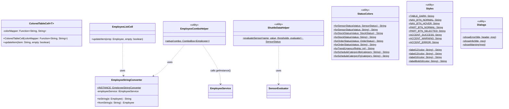
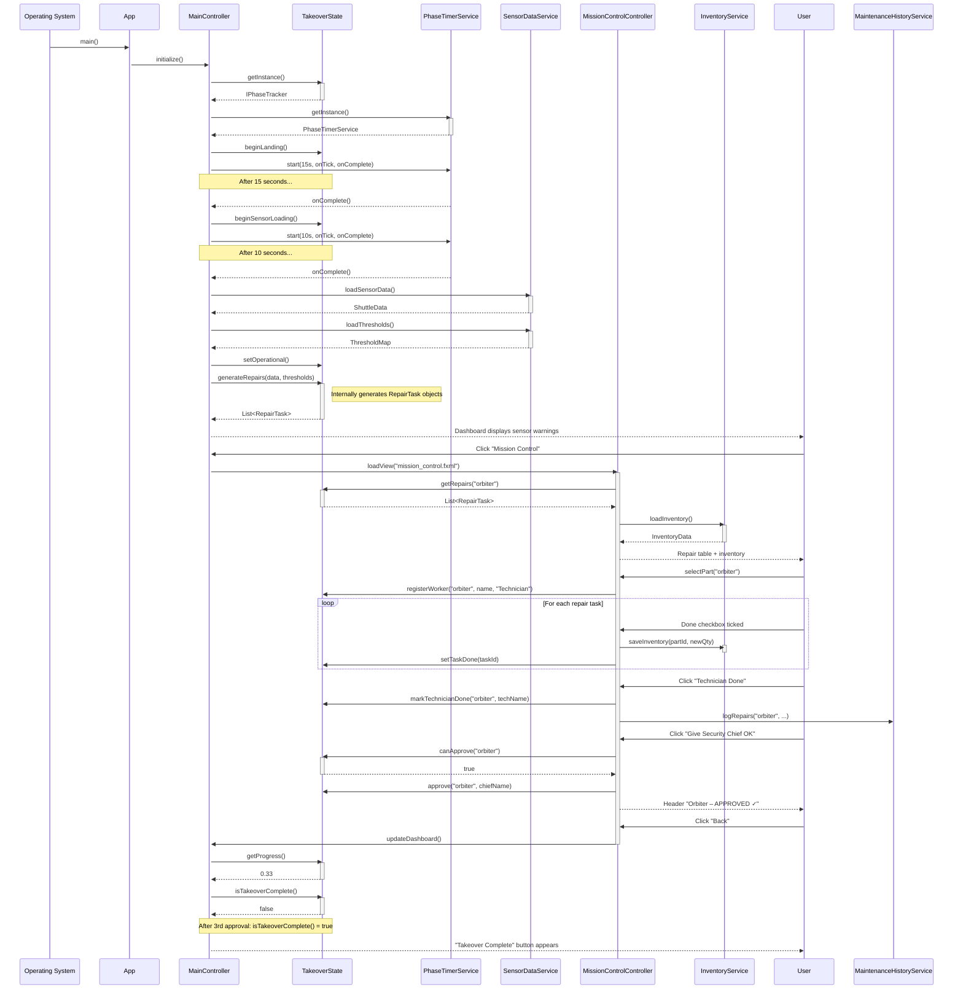
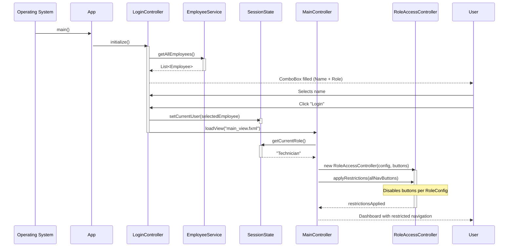
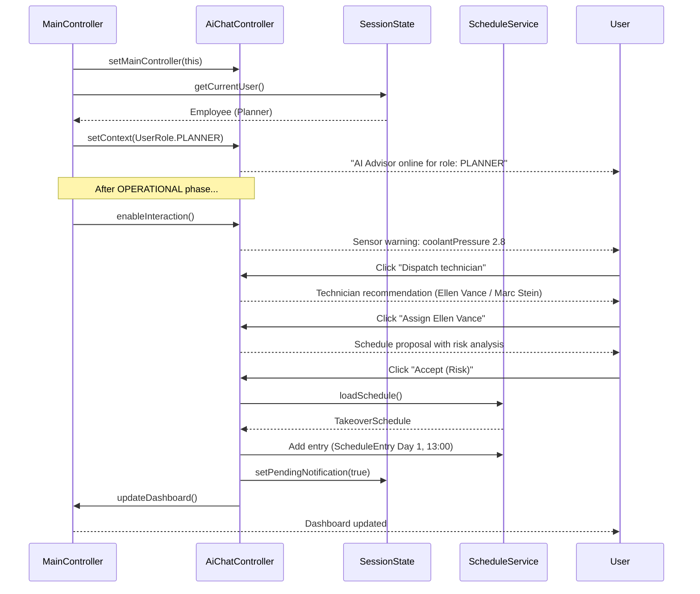

# Shuttle Dashboard — Technical Documentation

**Group 5 · Java/JavaFX Project**

---
## 0. Disclaimer: 
The overall structure, functionality, architecture, and core design concepts of this project were independently planned and developed by the project team. The initial prototype and parts of the implementation were created with the assistance of AI-based development tools. All generated code was subsequently reviewed, adapted, tested, and refined manually to ensure functionality, stability, maintainability, and overall code quality.

## 1. Project Overview

The Shuttle Dashboard is a JavaFX application for managing and monitoring the handover process of a space shuttle. It simulates the complete workflow after landing: from sensor calibration through repair of defective components to sign-off by the Security Chief.

### Core Features

| Feature | Description |
|---|---|
| **Login** | Demo login via name selection; role controls navigation visibility |
| **Phase Management** | Automatic workflow: Landing → Sensor Loading → Operational |
| **Mission Control** | Repair tasks per shuttle part, technician assignment, approval |
| **Logistics** | Order workflow with Security Chief approval |
| **Predictive Analysis** | Trend evaluation over 5 flight histories; early warning system |
| **Schedule** | Interactive 3-day handover plan with reassignment functionality |
| **Staff** | Employee management and team overview |
| **Inventory** | Stock level display with color-coded status |
| **History** | Log of completed maintenance tickets |
| **AI Advisor** | Role-based AI chat (FSM) for Planners; read-only for other roles |

### Tech Stack

| Component | Version |
|---|---|
| Java | 17 |
| JavaFX | 21.0.2 |
| Build Tool | Maven |
| UI Definition | FXML |

### Entry Point

```
Main.java → App.java → login_view.fxml → LoginController → main_view.fxml → MainController
```

---

## 2. Architecture

### Architectural Pattern: MVC

The application follows the **Model-View-Controller** pattern with strict layer separation:

- **Model** (`model/`): Plain Java Objects (POJOs) and Enums — no logic, only data and JavaFX properties
- **View** (`resources/view/*.fxml`): Declarative UI definitions in FXML
- **Controller** (`controller/`): Connect UI events with services; no data access logic
- **Service** (`service/`): Business logic, data access; all stateful services as singletons

### Package Structure

| Package | Classes / Interfaces | Responsibility |
|---|---|---|
| `com.group5.shuttle` | 2 classes | App entry point (`Main`, `App`) |
| `controller` | 20 classes | UI logic, event handling, panel controllers, helpers |
| `service` | 24 classes + 12 interfaces | Business logic, data access, static helpers |
| `model` | 17 classes + 4 enums | Data model (POJOs, JavaFX properties, enums) |
| `util` | 8 classes | Cross-cutting concerns (colors, converters, table cells) |

### Design Patterns Used

**Singleton**
All stateful services maintain exactly one instance throughout the session. Implemented with Holder class:
`TakeoverState`, `SessionState`, `EmployeeService`, `InventoryService`, `SensorDataService`, `ScheduleService`, `FlightHistoryService`, `PhaseTimerService`, `TicketStore`, `OrderStore`, `RoutineTaskStore`

**Template Method**
`BaseController` defines `loadView(fxml)` as a template: `getNavigationButton()` is abstract — subclasses provide the concrete button so that `loadView` can find the active window. `setupBackButton(btn)` encapsulates the back-button pattern:

```java
// BaseController (abstract template)
protected void loadView(String fxml) {
    Parent root = new FXMLLoader(...).load();
    Stage stage = (Stage) getNavigationButton().getScene().getWindow();
    stage.getScene().setRoot(root);
}
protected void setupBackButton(Button btn) {
    btn.setOnAction(e -> loadView("main_view.fxml"));
}

// Subclass (concrete implementation)
@Override protected Button getNavigationButton() { return btnBack; }
```

**Strategy**
`ColoredTableCell` is the context; it accepts a `Function<String, String>` as a strategy. `StatusColors` provides concrete strategies for sensor, stock, and order status:

```java
new ColoredTableCell<>(StatusColors::forSensorStatus)
new ColoredTableCell<>(StatusColors::forStockStatus)
new ColoredTableCell<>(StatusColors::forOrderStatus)
```

**Observer (JavaFX Properties)**
`RepairTask` and `LogisticsOrder` use JavaFX Properties (`SimpleBooleanProperty`, `SimpleStringProperty`) so that table rows update automatically when state changes:

```java
private final BooleanProperty done       = new SimpleBooleanProperty(false);
private final StringProperty  partStatus = new SimpleStringProperty("NONE");
```

**Enum-carried Metadata (OCP)**
Enums carry domain metadata (color, label, style), eliminating switch statements. New value = one new enum entry:

```java
enum ScheduleStatus {
    ON_TIME(Styles.ACCENT_SUCCESS, "On Schedule", "#66ff66"),
    HOURS_BEHIND(Styles.ACCENT_WARNING, "Behind Schedule", "#ffcc00"),
    DAY_BEHIND(Styles.ACCENT_ERROR, "1+ Day Behind", "#ff4444");
    // ...
}
```

**Finite State Machine (AI Chat)**
`AiChatController` implements a role-based advisory dialog as an FSM with states `IDLE → SENSOR_WARNING → TECHNICIAN_RECOMMENDATION → SCHEDULE_PROPOSED → FINISHED`. Only the Planner role receives interactive access.

---

## 3. UML Class Diagram

### 3a. Controller Hierarchy

```mermaid
classDiagram
    class BaseController {
        <<abstract>>
        #getNavigationButton()* Button
        #setupBackButton(btn: Button)
        #loadView(fxml: String)
    }

    class LoginController {
        -employeeService: EmployeeService
        +initialize()
        +handleLogin()
    }

    class MainController {
        -sensorService: ISensorDataService
        -scheduleService: IScheduleService
        -phaseTracker: IPhaseTracker
        -partApproval: IPartApproval
        -takeoverProgress: ITakeoverProgress
        -workerReg: IWorkerRegistry
        -repairAccess: IRepairAccess
        -predictiveService: IPredictiveAnalysisService
        -phaseTimer: PhaseTimerService
        +initialize()
        +loadView(fxml: String)
        +updateDashboard()
    }

    class MissionControlController {
        -workerRegistry: IWorkerRegistry
        -repairAccess: IRepairAccess
        -partApproval: IPartApproval
        -inventoryService: IInventoryService
        -scheduleService: IScheduleService
        -partButtons: Map~String, Button~
        +initialize()
    }

    class TechnicianController {
        -sensorService: ISensorDataService
        +initialize()
    }

    class HistoryController {
        -ticketStore: TicketStore
        +initialize()
    }

    class InventoryController {
        -inventoryService: InventoryService
        +initialize()
    }

    class LogisticsController {
        -inventoryService: IInventoryService
        -employeeService: IEmployeeService
        +initialize()
    }

    class ScheduleController {
        -scheduleService: IScheduleService
        +initialize()
        +getInstance()$ ScheduleController
        +refreshSchedule()
    }

    class StaffController {
        -workerRegistry: IWorkerRegistry
        -repairAccess: IRepairAccess
        +initialize()
    }

    BaseController <|-- MainController
    BaseController <|-- MissionControlController
    BaseController <|-- TechnicianController
    BaseController <|-- HistoryController
    BaseController <|-- InventoryController
    BaseController <|-- LogisticsController
    BaseController <|-- ScheduleController
    BaseController <|-- StaffController

    class SensorPanelController {
        -sensorService: SensorEvaluator
        -partApproval: IPartApproval
        +update(data: ShuttleData, thresholds: Map)
    }

    class SchedulePanelController {
        -scheduleService: IScheduleService
        -employeeService: IEmployeeService
        +update()
    }

    class PredictivePanelController {
        -predictiveService: IPredictiveAnalysisService
        +update()
    }

    class InventoryStatusPanelController {
        -inventoryService: IInventoryService
        +update(displayName: String)
    }

    class AiChatController {
        -userRole: UserRole
        -mainController: MainController
        +setMainController(mc: MainController)
        +setContext(role: UserRole)
        +enableInteraction()
        +handleInput()
    }

    class RoleAccessController {
        -restrictionIds: Map~String, List~
        -buttonLookup: Map~String, Button~
        +applyRestrictions(allNavButtons: List)
    }

    class RoleConfig {
        <<utility>>
        +RESTRICTED_BUTTONS: Map$
    }

    class RoutineTableHelper {
        <<utility>>
        +setup(table, colName, colEst, colDone, colTime)$
    }

    class PartStatusCell {
        +updateItem(status: String, empty: boolean)
    }

    class SensorStatusCell {
        +updateItem(item: String, empty: boolean)
    }

    MainController --> SensorPanelController : creates
    MainController --> SchedulePanelController : creates
    MainController --> PredictivePanelController : creates
    MainController --> AiChatController : creates
    MainController --> RoleAccessController : creates
    RoleAccessController ..> RoleConfig : reads
    MissionControlController --> InventoryStatusPanelController : creates
    MissionControlController ..> RoutineTableHelper : uses
    StaffController ..> RoutineTableHelper : uses
    AiChatController --> SessionState : uses
    AiChatController ..> ScheduleService : uses
```



---

### 3b. Service Interfaces and Implementations

```mermaid
classDiagram
    class SensorEvaluator {
        <<interface>>
        +evaluate(value: double, threshold: SensorThreshold) SensorStatus
    }

    class ISensorDataService {
        <<interface>>
        +loadSensorData() ShuttleData
        +loadThresholds() Map
    }

    class IEmployeeService {
        <<interface>>
        +getAllEmployees() List~Employee~
        +getById(id: String) Optional~Employee~
        +getByRole(role: String) List~Employee~
        +getByTeam(team: String) List~Employee~
    }

    class IInventoryService {
        <<interface>>
        +loadInventory() List~InventoryItem~
        +saveInventory(items: List)
    }

    class IScheduleService {
        <<interface>>
        +loadSchedule() TakeoverSchedule
    }

    class IFlightHistoryService {
        <<interface>>
        +loadFlightHistory() FlightHistory
    }

    class IPredictiveAnalysisService {
        <<interface>>
        +analyzeAll() Map~String, List~TrendResult~~
    }

    class IPartApproval {
        <<interface>>
        +isPartApproved(partKey: String) boolean
        +canApprove(partKey: String) boolean
        +approve(partKey: String, chiefName: String)
    }

    class IRepairAccess {
        <<interface>>
        +getRepairs(partKey: String) List~RepairTask~
        +allRepairsDone(partKey: String) boolean
        +isTechnicianDone(partKey: String) boolean
        +markTechnicianDone(partKey: String, techName: String)
        +generateRepairs(data, thresholds, evaluator)
    }

    class ITakeoverProgress {
        <<interface>>
        +getProgress() double
        +isTakeoverComplete() boolean
        +getLastActivity() String
    }

    class IWorkerRegistry {
        <<interface>>
        +registerWorker(partKey, name, role)
        +getWorkerInfo(partKey: String) String
        +getTechnicianName(partKey: String) String
        +getSecurityChiefName(partKey: String) String
    }

    class IPhaseTracker {
        <<interface>>
        +getAppPhase() AppPhase
        +getRemainingSeconds() int
        +getSimulatedHoursElapsed() double
        +getScheduleStatus() ScheduleStatus
        +beginLanding()
        +beginSensorLoading()
        +setOperational()
        +reset()
    }

    ISensorDataService --|> SensorEvaluator

    class TakeoverState {
        <<Singleton>>
        +PART_KEYS: String[]$
        +LANDING_SECONDS: int$
        +SENSOR_LOADING_SECONDS: int$
        +getInstance()$ TakeoverState
        +getDisplayName(partKey: String)$ String
        +reset()
    }

    class EmployeeService {
        <<Singleton>>
        +getInstance()$ EmployeeService
        +getAllEmployees() List~Employee~
        +getById(id: String) Optional~Employee~
        +getByRole(role: String) List~Employee~
        +getByTeam(team: String) List~Employee~
    }

    class SensorDataService {
        <<Singleton>>
        +getInstance()$ SensorDataService
        +loadSensorData() ShuttleData
        +loadThresholds() Map
        +evaluate(value: double, t: SensorThreshold) SensorStatus
    }

    class InventoryService {
        <<Singleton>>
        +getInstance()$ InventoryService
        +loadInventory() List~InventoryItem~
        +saveInventory(items: List)
    }

    class ScheduleService {
        <<Singleton>>
        +getInstance()$ ScheduleService
        +loadSchedule() TakeoverSchedule
    }

    class FlightHistoryService {
        <<Singleton>>
        +getInstance()$ FlightHistoryService
        +loadFlightHistory() FlightHistory
    }

    class PredictiveAnalysisService {
        -flightHistoryService: IFlightHistoryService
        -sensorDataService: ISensorDataService
        +analyzeAll() Map~String, List~TrendResult~~
    }

    class SessionState {
        <<Singleton>>
        -currentUser: Employee
        -currentUserRole: UserRole
        -pendingNotification: boolean
        +getInstance()$ SessionState
        +setCurrentUser(e: Employee)
        +getCurrentUser() Employee
        +setUserRole(role: UserRole)
        +getUserRole() UserRole
        +getCurrentRole() String
        +hasPendingNotification() boolean
        +setPendingNotification(value: boolean)
        +isLoggedIn() boolean
    }

    class RoutineTaskStore {
        <<Singleton>>
        +getInstance()$ RoutineTaskStore
        +getAllTasks() List~RoutineTask~
        +getTasksForEmployee(empId: String) List~RoutineTask~
        +getTasksForPart(part: String) List~RoutineTask~
        +getById(id: String) Optional~RoutineTask~
        +reset()
    }

    class PhaseTimerService {
        <<Singleton>>
        +getInstance()$ PhaseTimerService
        +start(seconds: int, onTick: Consumer, onComplete: Runnable)
        +stop()
    }

    class AbstractStore~T~ {
        <<abstract>>
        #items: List~T~
        +getAll() List~T~
        +clear()
    }

    class OrderStore {
        <<Singleton>>
        +getInstance()$ OrderStore
        +createOrder(partName, qty, orderedBy, reason) LogisticsOrder
        +getOrders() List~LogisticsOrder~
        +clear()
    }

    class TicketStore {
        <<Singleton>>
        +getInstance()$ TicketStore
        +getTickets() List~MaintenanceTicket~
        +saveTickets(tickets: List)
    }

    TakeoverState ..|> IWorkerRegistry
    TakeoverState ..|> IRepairAccess
    TakeoverState ..|> IPartApproval
    TakeoverState ..|> ITakeoverProgress
    TakeoverState ..|> IPhaseTracker
    EmployeeService ..|> IEmployeeService
    SensorDataService ..|> ISensorDataService
    InventoryService ..|> IInventoryService
    ScheduleService ..|> IScheduleService
    FlightHistoryService ..|> IFlightHistoryService
    PredictiveAnalysisService ..|> IPredictiveAnalysisService
    AbstractStore <|-- OrderStore
    AbstractStore <|-- TicketStore

    PredictiveAnalysisService --> IFlightHistoryService
    PredictiveAnalysisService --> ISensorDataService

    class AppPhaseState {
        -appPhase: AppPhase
        -MILESTONES: Map~String, Double~$
        +beginLanding()
        +beginSensorLoading()
        +setOperational()
        +getRemainingSeconds() int
        +getSimulatedHoursElapsed() double
        +getScheduleStatus(approval: IPartApproval) ScheduleStatus
        +reset()
    }

    TakeoverState *-- AppPhaseState

    class AiAdvisorService {
        <<utility>>
        +getResponse(message: String)$ String
    }

    class OrderApprovalService {
        <<utility>>
        +approve(order, invService, empService, onDelivered)$
        +reject(order, empService)$
    }

    class OrderDeliveryService {
        <<utility>>
        +DELIVERY_SECONDS: int$
        +scheduleDelivery(onDelivered: Runnable)$
    }

    class RepairInventoryService {
        <<utility>>
        +initTaskStatuses(tasks, inventoryService)$
        +placeOrder(task, inventoryService, onArrived)$
        +deductInventory(task, inventoryService, onDeducted)$
    }

    class RepairPlanningService {
        <<utility>>
        +plan(data, thresholds, evaluator, inventoryService)$ Map
    }

    class MaintenanceHistoryService {
        <<utility>>
        +logRepairs(partKey, repairAccess, workerRegistry)$
    }

    class SensorStatusAggregator {
        <<utility>>
        +findWorstSensorStatus(data, thresholds, evaluator)$ SensorStatus
    }

    class InventoryStatusCalculator {
        <<utility>>
        +calculate(quantity: int)$ StockStatus
    }

    class TrendCalculator {
        <<utility>>
        +computeFlightsUntilLimit(current, trend, threshold)$ int
        +buildRecommendation(sensor, trend, direction, flights)$ String
    }

    class LogisticsOrderService {
        <<utility>>
        +approve(order, chief)$
        +reject(order, chief)$
        +markOrdered(order)$
        +markDelivered(order)$
    }

    TakeoverState ..> RepairPlanningService
    OrderApprovalService ..> OrderDeliveryService
    OrderApprovalService ..> LogisticsOrderService
    RepairInventoryService ..> OrderDeliveryService
```



---

### 3c. Model Classes and Enums

```mermaid
classDiagram
    class Employee {
        -id: String
        -name: String
        -role: String
        -team: String
        +toString() String
    }

    class InventoryItem {
        -id: String
        -name: String
        -part: String
        -quantity: int
        -status: StockStatus
        -description: String
        +setQuantity(qty: int)
        +setStatus(s: StockStatus)
    }

    class LogisticsOrder {
        -orderNumber: String
        -partName: String
        -quantity: int
        -orderedByName: String
        -status: OrderStatus
        -statusProperty: SimpleStringProperty
        +getOrderStatus() OrderStatus
        +setStatus(s: OrderStatus)
        +statusProperty() SimpleStringProperty
    }

    class RepairTask {
        -partKey: String
        -sensorName: SimpleStringProperty
        -status: SimpleStringProperty
        -action: SimpleStringProperty
        -done: SimpleBooleanProperty
        -requiredItemName: String
        -partStatus: SimpleStringProperty
        -partAvailable: SimpleBooleanProperty
        +doneProperty() BooleanProperty
        +partStatusProperty() StringProperty
        +setDone(done: boolean)
        +setPartStatus(s: StockStatus)
        +isPartAvailable() boolean
    }

    class RoutineTask {
        -id: String
        -name: String
        -shuttlePart: String
        -estimatedMinutes: int
        -assignedEmployeeId: String
        -done: SimpleBooleanProperty
        -completedAt: String
        +doneProperty() BooleanProperty
        +setDone(done: boolean)
        +setCompletedAt(ts: String)
    }

    class MaintenanceTicket {
        -id: String
        -date: String
        -part: String
        -sensor: String
        -oldStatus: String
        -action: String
        -technician: String
    }

    class ShuttleData {
        -parts: Map~String, ShuttlePart~
        +getAllParts() Map~String, ShuttlePart~
        +setOrbiter(p: ShuttlePart)
        +setSrb(p: ShuttlePart)
        +setExternalTank(p: ShuttlePart)
    }

    class ShuttlePart {
        -sensors: Map~String, Double~
        +getSensors() Map~String, Double~
        +setSensor(key: String, value: Double)
    }

    class SensorThreshold {
        -min: Double
        -max: Double
        -warningBuffer: double
        +getMin() Double
        +getMax() Double
        +getWarningBuffer() double
    }

    class SensorRow {
        -part: SimpleStringProperty
        -sensor: SimpleStringProperty
        -value: SimpleStringProperty
        -status: SimpleStringProperty
    }

    class PartState {
        -technicianName: String
        -securityChiefName: String
        -securityApproved: boolean
        -technicianDone: boolean
        -repairs: List~RepairTask~
        +reset()
    }

    class TrendResult {
        -partKey: String
        -sensorName: String
        -trendPerFlight: double
        -direction: String
        -recommendation: String
        -flightsUntilLimit: int
    }

    class TakeoverSchedule {
        -takeoverTitle: String
        -days: List~ScheduleDay~
    }

    class ScheduleDay {
        -dayNumber: int
        -label: String
        -entries: ObservableList~ScheduleEntry~
        +getDayNumber() int
        +getEntries() List~ScheduleEntry~
    }

    class ScheduleEntry {
        -time: String
        -task: String
        -category: String
        -assignedEmployeeId: String
        -shuttlePart: String
        +setAssignedEmployeeId(id: String)
    }

    class FlightHistory {
        -flights: List~FlightRecord~
    }

    class FlightRecord {
        -flightId: String
        -flightNumber: int
        -sensors: Map~String, Map~String, Double~~
        +getFlightNumber() int
        +getSensors() Map
    }

    class OrderStatus {
        <<enum>>
        PENDING_APPROVAL
        APPROVED
        REJECTED
        ORDERED
        DELIVERED
        +getColor() String
    }

    class SensorStatus {
        <<enum>>
        OK
        WARNING
        REPLACE
        +getColor() String
    }

    class StockStatus {
        <<enum>>
        NONE
        IN_STOCK
        LOW
        OUT_OF_STOCK
        ORDERED
        ARRIVED
        +getLabel() String
        +getColor() String
        +showsButton() boolean
        +skipsStatusInit() boolean
    }

    class UserRole {
        <<enum>>
        PLANNER
        SECURITY
        TECHNICIAN
        LOGISTICIAN
    }

    class AppPhase {
        <<enum>>
        LANDING
        SENSOR_LOADING
        OPERATIONAL
    }

    class ScheduleStatus {
        <<enum>>
        ON_TIME
        HOURS_BEHIND
        DAY_BEHIND
        +getProgressStyle() String
        +getLabel() String
        +getColor() String
    }

    note for AppPhase "nested enum in IPhaseTracker"
    note for ScheduleStatus "nested enum in IPhaseTracker"

    ShuttleData *-- ShuttlePart
    TakeoverSchedule *-- ScheduleDay
    ScheduleDay *-- ScheduleEntry
    FlightHistory *-- FlightRecord
    PartState *-- RepairTask
    InventoryItem --> StockStatus
    RepairTask --> SensorStatus
    RepairTask --> StockStatus
    LogisticsOrder --> OrderStatus
```



---

### 3d. Utility Classes



---

### 3e. Controller → Service Dependencies (Dependency Inversion)

```mermaid
classDiagram
    class LoginController
    class MainController
    class MissionControlController
    class LogisticsController
    class ScheduleController
    class StaffController
    class TechnicianController
    class SensorPanelController
    class SchedulePanelController
    class PredictivePanelController
    class InventoryStatusPanelController
    class AiChatController

    class IEmployeeService { <<interface>> }
    class ISensorDataService { <<interface>> }
    class IInventoryService { <<interface>> }
    class IScheduleService { <<interface>> }
    class IPredictiveAnalysisService { <<interface>> }
    class IPartApproval { <<interface>> }
    class IRepairAccess { <<interface>> }
    class ITakeoverProgress { <<interface>> }
    class IWorkerRegistry { <<interface>> }
    class IPhaseTracker { <<interface>> }
    class SensorEvaluator { <<interface>> }

    class SessionState { <<Singleton>> }
    class TakeoverState { <<Singleton>> }
    class EmployeeService { <<Singleton>> }
    class SensorDataService { <<Singleton>> }
    class InventoryService { <<Singleton>> }
    class ScheduleService { <<Singleton>> }
    class PredictiveAnalysisService

    TakeoverState ..|> IPartApproval
    TakeoverState ..|> IRepairAccess
    TakeoverState ..|> ITakeoverProgress
    TakeoverState ..|> IWorkerRegistry
    TakeoverState ..|> IPhaseTracker
    EmployeeService ..|> IEmployeeService
    SensorDataService ..|> ISensorDataService
    SensorDataService ..|> SensorEvaluator
    InventoryService ..|> IInventoryService
    ScheduleService ..|> IScheduleService
    PredictiveAnalysisService ..|> IPredictiveAnalysisService

    LoginController --> IEmployeeService
    LoginController --> SessionState
    MainController --> ISensorDataService
    MainController --> IScheduleService
    MainController --> IPhaseTracker
    MainController --> IPartApproval
    MainController --> ITakeoverProgress
    MainController --> IWorkerRegistry
    MainController --> IRepairAccess
    MainController --> IPredictiveAnalysisService
    MainController --> SessionState
    MissionControlController --> IWorkerRegistry
    MissionControlController --> IRepairAccess
    MissionControlController --> IPartApproval
    MissionControlController --> IInventoryService
    MissionControlController --> IScheduleService
    LogisticsController --> IInventoryService
    LogisticsController --> IEmployeeService
    StaffController --> IWorkerRegistry
    StaffController --> IRepairAccess
    ScheduleController --> IScheduleService
    ScheduleController --> EmployeeService
    TechnicianController --> ISensorDataService
    SensorPanelController --> SensorEvaluator
    SensorPanelController --> IPartApproval
    SchedulePanelController --> IScheduleService
    SchedulePanelController --> IEmployeeService
    PredictivePanelController --> IPredictiveAnalysisService
    InventoryStatusPanelController --> IInventoryService
    AiChatController --> SessionState
    AiChatController --> ScheduleService
```



---

## 4. UML Sequence Diagram — Takeover Workflow

Shows the complete flow from app start to sign-off of a shuttle part by the Security Chief.



---

## 4b. UML Sequence Diagram — Login & Role-Based Access



---

## 4c. UML Sequence Diagram — AI Advisor (Planner Workflow)



---

## 5. Program Logic — Core Processes

### 5.1 Login & Role-Based Access

The application starts with a demo login screen. The user selects their name from a ComboBox — all employees are loaded via `EmployeeService.getAllEmployees()` and rendered with `EmployeeListCell` (uses `EmployeeStringConverter`).

After selection, `SessionState` (singleton) stores both the logged-in employee and the `UserRole` enum for the entire session. `MainController` reads the role and delegates button locking to `RoleAccessController`, which reads its configuration from `RoleConfig.RESTRICTED_BUTTONS` (OCP: new role = one entry in `RoleConfig`, no other code changes):

| Role | Restricted Navigation |
|---|---|
| **Security Chief** | nothing — full access |
| **Technician** | Inventory, History, Staff, Logistics, Schedule |
| **Planner** | Mission Control, Technician View, Inventory, History, Logistics |
| **Logistics** | Mission Control, Technician View, History, Staff, Schedule |

### 5.2 Phase Management

The application cycles through three phases, controlled by `PhaseTimerService` (JavaFX `Timeline`):

| Phase | Duration | Description |
|---|---|---|
| **LANDING** | 15 seconds | Shuttle landing; only Logistics accessible |
| **SENSOR_LOADING** | 10 seconds | Sensor data simulated loading |
| **OPERATIONAL** | Unlimited | Full operation; repairs can begin |

`AppPhaseState` calculates simulated hours since the Operational start. Based on milestones (`orbiter` = 15 h, `srb` = 38 h, `externalTank` = 40 h) the `ScheduleStatus` is determined (`ON_TIME`, `HOURS_BEHIND`, `DAY_BEHIND`). The `ScheduleStatus` enum carries color, label, and CSS style (OCP).

### 5.3 Repair Workflow

```
1. Technician selects part → system registers them via IWorkerRegistry
2. RepairPlanningService creates RepairTasks from sensor data (WARNING/REPLACE)
3. Per task: check stock level via IInventoryService
   → IN_STOCK:     checkbox → stock -1 via RepairInventoryService
   → OUT_OF_STOCK: order → OrderDeliveryService simulates 10s delivery → ARRIVED
4. All tasks done → "Technician Done"
   → MaintenanceHistoryService writes tickets to TicketStore
5. Security Chief logs in → canApprove() = true → "Approve"
   → IPartApproval.approve() → progress +33%
6. After 3 parts: ITakeoverProgress.isTakeoverComplete() = true
```

### 5.4 Logistics Order Workflow

```
PENDING_APPROVAL → (Approve) → ORDERED → (10s delivery) → DELIVERED
                 → (Reject)  → REJECTED
```

`OrderApprovalService` delegates to `LogisticsOrderService` (status update) and `OrderDeliveryService` (10-second timer). After delivery, `InventoryService` automatically increases stock levels.

### 5.5 Predictive Analysis

`PredictiveAnalysisService` (implements `IPredictiveAnalysisService`) evaluates 5 stored flight histories:

1. For each sensor: values from the last 5 flights from `FlightHistoryService`
2. Trend = linear slope = (last − first value) / (count − 1)
3. Classification: `RISING` / `FALLING` / `STABLE`
4. `TrendCalculator.computeFlightsUntilLimit()` calculates how many flights remain until a sensor exceeds its threshold
5. Critical trends are displayed in the dashboard panel via `PredictivePanelController`

### 5.6 AI Advisor

`AiChatController` implements a role-based advisory dialog as a **Finite State Machine**:

| State | Description |
|---|---|
| `IDLE` | Waiting for sensor data |
| `SENSOR_WARNING` | Critical sensor finding displayed |
| `TECHNICIAN_RECOMMENDATION` | Technician selection proposed |
| `SCHEDULE_PROPOSED` | Schedule with risk analysis presented |
| `FINISHED` | Workflow completed |

Only the role `UserRole.PLANNER` receives interactive access. Other roles see a read-only notice. After an assignment, `SessionState.setPendingNotification(true)` sets a notification flag that appears as an alert for the technician on the next dashboard refresh.

### 5.7 SOLID Compliance

| Principle | Implementation |
|---|---|
| **S** | Each class has a clearly defined responsibility; panel controllers separate dashboard sections; `AppPhaseState`, `SensorStatusAggregator`, `InventoryStatusCalculator` extracted |
| **O** | Enums carry metadata (color, label); `RoleConfig` is the single change point for new roles; `AiAdvisorService` uses maps instead of if-chains |
| **L** | All interface implementations fully satisfy their contracts; `OrderStore.clear()` calls `super.clear()` |
| **I** | 12 focused interfaces (`IPartApproval`, `IRepairAccess`, `ITakeoverProgress`, `IWorkerRegistry`, `IPhaseTracker`, `SensorEvaluator`, …) instead of a monolithic interface |
| **D** | Controller fields are typed as interfaces; `RepairPlanningService.plan()` and `SensorStatusAggregator` receive dependencies as parameters |

---

## 6. Setup & Execution

### Prerequisites

- Java 17 or higher
- Maven 3.6+

### Run

```bash
cd shuttle-dashboard
mvn clean javafx:run
```

### Compile Without Running

```bash
mvn compile
```

### Project Structure

```
shuttle-dashboard/
├── pom.xml
└── src/main/
    ├── java/com/group5/shuttle/
    │   ├── App.java                              ← JavaFX Application entry point
    │   ├── Main.java                             ← OS entry point (launcher wrapper)
    │   ├── controller/
    │   │   ├── BaseController.java               ← abstract base class (Template Method)
    │   │   ├── LoginController.java              ← login screen (not a BaseController)
    │   │   ├── MainController.java               ← main dashboard
    │   │   ├── MissionControlController.java     ← repairs & approval
    │   │   ├── TechnicianController.java         ← sensor overview
    │   │   ├── HistoryController.java            ← maintenance log
    │   │   ├── InventoryController.java          ← stock levels
    │   │   ├── LogisticsController.java          ← order workflow
    │   │   ├── ScheduleController.java           ← 3-day plan
    │   │   ├── StaffController.java              ← employee management
    │   │   ├── SensorPanelController.java        ← dashboard panel: sensors
    │   │   ├── SchedulePanelController.java      ← dashboard panel: schedule
    │   │   ├── PredictivePanelController.java    ← dashboard panel: predictions
    │   │   ├── InventoryStatusPanelController.java ← dashboard panel: inventory
    │   │   ├── AiChatController.java             ← AI chat drawer (FSM, Planner role)
    │   │   ├── RoleAccessController.java         ← role-based access control
    │   │   ├── RoleConfig.java                   ← role configuration (OCP)
    │   │   ├── RoutineTableHelper.java           ← table setup helper (DRY)
    │   │   ├── PartStatusCell.java               ← table cell: part status
    │   │   └── SensorStatusCell.java             ← table cell: sensor status
    │   ├── service/
    │   │   ├── interfaces: IEmployeeService, IInventoryService, IScheduleService,
    │   │   │               IFlightHistoryService, IPredictiveAnalysisService,
    │   │   │               ISensorDataService, SensorEvaluator,
    │   │   │               IPartApproval, IRepairAccess, ITakeoverProgress,
    │   │   │               IWorkerRegistry, IPhaseTracker
    │   │   ├── TakeoverState.java                ← core singleton (5 interfaces)
    │   │   ├── AppPhaseState.java                ← phase logic (extracted from TakeoverState)
    │   │   ├── SessionState.java                 ← logged-in user + UserRole
    │   │   ├── PhaseTimerService.java            ← JavaFX timer
    │   │   ├── EmployeeService.java              ← employee data
    │   │   ├── InventoryService.java             ← inventory management
    │   │   ├── SensorDataService.java            ← sensor data & thresholds
    │   │   ├── ScheduleService.java              ← schedule data
    │   │   ├── FlightHistoryService.java         ← flight histories
    │   │   ├── PredictiveAnalysisService.java    ← trend analysis
    │   │   ├── RoutineTaskStore.java             ← routine tasks
    │   │   ├── OrderStore.java                   ← orders
    │   │   ├── TicketStore.java                  ← maintenance tickets
    │   │   ├── AbstractStore.java                ← generic store base
    │   │   ├── AiAdvisorService.java             ← AI demo responses (static maps)
    │   │   ├── OrderApprovalService.java         ← order approval
    │   │   ├── OrderDeliveryService.java         ← delivery simulation (10s)
    │   │   ├── RepairInventoryService.java       ← repair inventory logic
    │   │   ├── RepairPlanningService.java        ← repair planning
    │   │   ├── MaintenanceHistoryService.java    ← ticket logging
    │   │   ├── SensorStatusAggregator.java       ← sensor status aggregation
    │   │   ├── InventoryStatusCalculator.java    ← stock status calculation
    │   │   ├── TrendCalculator.java              ← trend calculation
    │   │   └── LogisticsOrderService.java        ← order status transitions
    │   ├── model/
    │   │   ├── Employee.java, InventoryItem.java, LogisticsOrder.java
    │   │   ├── RepairTask.java, RoutineTask.java, MaintenanceTicket.java
    │   │   ├── ShuttleData.java, ShuttlePart.java, SensorThreshold.java
    │   │   ├── SensorRow.java, PartState.java, TrendResult.java
    │   │   ├── TakeoverSchedule.java, ScheduleDay.java, ScheduleEntry.java
    │   │   ├── FlightHistory.java, FlightRecord.java
    │   │   ├── UserRole.java                     ← role enum (PLANNER, SECURITY, TECHNICIAN, LOGISTICIAN)
    │   │   └── enums: OrderStatus, SensorStatus, StockStatus
    │   │              (AppPhase, ScheduleStatus as nested enums in IPhaseTracker)
    │   └── util/
    │       ├── ColoredTableCell.java             ← generic table cell (Strategy)
    │       ├── EmployeeStringConverter.java      ← StringConverter for ComboBox
    │       ├── EmployeeListCell.java             ← ListCell for ComboBox/ListView
    │       ├── EmployeeComboHelper.java          ← ComboBox setup (DRY)
    │       ├── ShuttleDataHelper.java            ← sensor evaluation helper (DRY)
    │       ├── StatusColors.java                 ← color coding by status
    │       ├── Styles.java                       ← CSS constants
    │       └── Dialogs.java                      ← alert helper methods
    └── resources/view/
        ├── login_view.fxml                       ← login screen
        ├── main_view.fxml                        ← main dashboard
        ├── ai_chat.fxml                          ← AI chat drawer
        ├── mission_control.fxml                  ← repairs & approval
        ├── logistics.fxml                        ← order workflow
        ├── schedule_view.fxml                    ← 3-day plan
        ├── technician.fxml                       ← sensor overview
        ├── staff.fxml                            ← employee management
        ├── inventory.fxml                        ← stock levels
        └── history.fxml                          ← maintenance log
```
