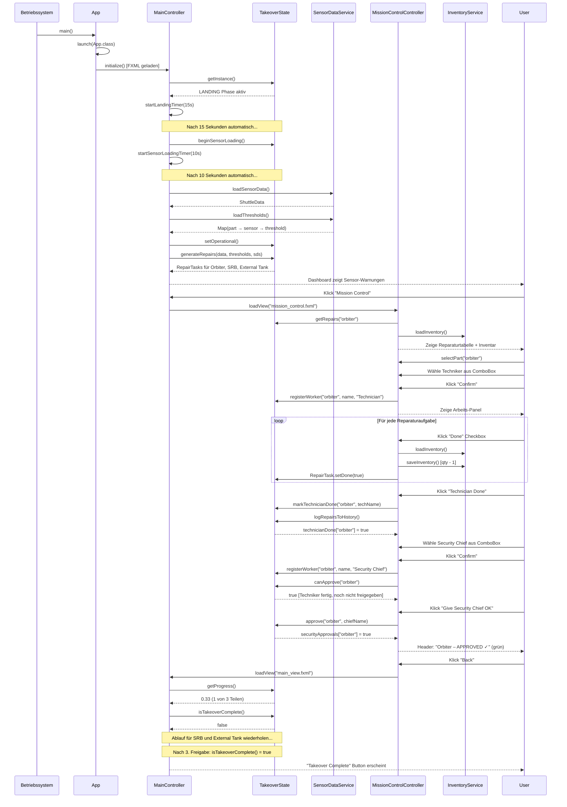
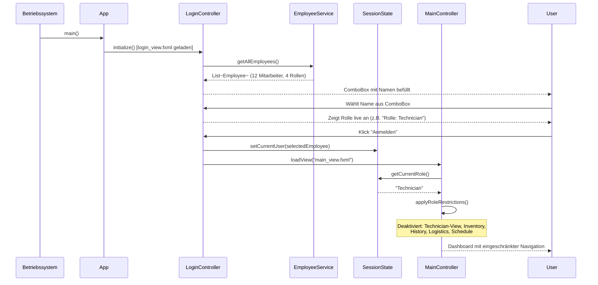

# Shuttle Dashboard — Technische Dokumentation KI-generiert

**Gruppe 5 · Java/JavaFX Projekt**

---

## 1. Projektübersicht

Das Shuttle Dashboard ist eine JavaFX-Anwendung zur Steuerung und Überwachung des Übergabeprozesses einer Raumfähre. Es simuliert den vollständigen Ablauf nach der Landung: von der Sensor-Kalibrierung über die Reparatur defekter Komponenten bis zur Freigabe durch den Security Chief.

### Kernfunktionen

| Funktion | Beschreibung |
|---|---|
| **Login** | Demo-Anmeldung per Namensauswahl; Rolle steuert Sichtbarkeit der Navigation |
| **Phasenverwaltung** | Automatischer Ablauf: Landing → Sensor Loading → Operational |
| **Mission Control** | Reparaturaufgaben pro Shuttle-Teil, Technikerzuweisung, Freigabe |
| **Logistics** | Bestellworkflow mit Genehmigung durch Security Chief |
| **Predictive Analysis** | Trendauswertung über 5 Flughistorien; Frühwarnsystem |
| **Schedule** | Interaktiver 3-Tage-Übergabeplan mit Umplanungsfunktion |
| **Staff** | Mitarbeiterverwaltung und Teamübersicht |
| **Inventory** | Lagerbestandsanzeige mit Statusfarbkodierung |
| **History** | Protokoll abgeschlossener Wartungstickets |

### Tech Stack

| Komponente | Version |
|---|---|
| Java | 17 |
| JavaFX | 21.0.2 |
| Build-Tool | Maven |
| UI-Definition | FXML |

### Einstiegspunkt

```
Main.java → App.java → login_view.fxml → LoginController → main_view.fxml → MainController
```

---

## 2. Architektur

### Architekturmuster: MVC

Die Anwendung folgt dem **Model-View-Controller**-Muster mit strikter Schichtentrennung:

- **Model** (`model/`): Plain Java Objects (POJOs) — keine Logik, nur Daten
- **View** (`resources/view/*.fxml`): Deklarative UI-Definitionen in FXML
- **Controller** (`controller/`): Verbinden UI-Events mit Services; keine Datenzugriffslogik
- **Service** (`service/`): Geschäftslogik, Datenzugriff; alle als Singletons implementiert

### Package-Struktur

| Package | Klassen | Verantwortlichkeit |
|---|---|---|
| `com.group5.shuttle` | 2 | App-Einstieg (`Main`, `App`) |
| `controller` | 12 | UI-Logik, Event-Handling (inkl. `LoginController`) |
| `service` | 12 | Geschäftslogik, Datenzugriff (inkl. `SessionState`) |
| `model` | 18 | Datenmodell (POJOs) |
| `util` | 2 | Querschnittsthemen (Farben, Tabellenzellen) |

### Verwendete Entwurfsmuster

**Singleton**  
Alle Services halten genau eine Instanz über die gesamte Sitzung:  
`TakeoverState`, `EmployeeService`, `InventoryService`, `SensorDataService`, `ScheduleService`, `FlightHistoryService`, `TicketStore`, `OrderStore`, `RoutineTaskStore`, `SessionState`

```java
// Beispiel: Singleton-Implementierung
public static InventoryService getInstance() {
    if (instance == null) instance = new InventoryService();
    return instance;
}
```

**Template Method**  
`BaseController` definiert die Navigationsmethode `loadView(fxml)`. Jede Subklasse implementiert `getNavigationButton()` — damit erhält `loadView` Zugriff auf das aktive Fenster:

```java
// BaseController (abstrakte Vorlage)
protected void loadView(String fxml) {
    Parent root = new FXMLLoader(...).load();
    Stage stage = (Stage) getNavigationButton().getScene().getWindow();
    stage.getScene().setRoot(root);
}

// Subklasse (konkrete Implementierung)
@Override
protected Button getNavigationButton() { return btnBack; }
```

**Observer (JavaFX Properties)**  
`RepairTask` verwendet JavaFX Properties (`SimpleBooleanProperty`, `SimpleStringProperty`), damit Tabellenzeilen sich automatisch aktualisieren, wenn sich der Zustand ändert — ohne manuelles `refresh()`:

```java
private final BooleanProperty done        = new SimpleBooleanProperty(false);
private final StringProperty  partStatus  = new SimpleStringProperty("NONE");
```

**Strategy**  
`ColoredTableCell` ist der Context: er nimmt eine `Function<String, String>` als Strategie entgegen. `StatusColors` liefert die konkreten Strategien für Sensor-, Lager- und Bestellstatus:

```java
// Konkreter Aufruf mit unterschiedlichen Strategien
new ColoredTableCell<>(StatusColors::forSensorStatus)
new ColoredTableCell<>(StatusColors::forStockStatus)
new ColoredTableCell<>(StatusColors::forOrderStatus)
```

---

## 3. UML Klassendiagramm

```mermaid
classDiagram
    class BaseController {
        <<abstract>>
        #loadView(fxml: String)
        #getNavigationButton()* Button
    }

    BaseController <|-- MainController
    BaseController <|-- MissionControlController
    BaseController <|-- TechnicianController
    BaseController <|-- InventoryController
    BaseController <|-- HistoryController
    BaseController <|-- StaffController
    BaseController <|-- LogisticsController
    BaseController <|-- ScheduleController
    BaseController <|-- RoleSelectionController
    BaseController <|-- LandingController

    class LoginController {
        -cmbEmployee: ComboBox
        +initialize()
        +handleLogin()
    }

    class SessionState {
        <<Singleton>>
        -instance: SessionState
        -currentUser: Employee
        +getInstance()$ SessionState
        +setCurrentUser(employee)
        +getCurrentUser() Employee
        +getCurrentRole() String
    }

    LoginController --> EmployeeService : lädt Mitarbeiter
    LoginController --> SessionState : setzt currentUser
    MainController --> SessionState : liest Rolle
    MainController --> TakeoverState : nutzt
    MainController --> SensorDataService : nutzt
    MainController --> ScheduleService : nutzt
    MissionControlController --> TakeoverState : nutzt
    MissionControlController --> InventoryService : nutzt
    MissionControlController --> ScheduleService : nutzt
    LogisticsController --> InventoryService : nutzt
    LogisticsController --> OrderStore : nutzt
    TechnicianController --> SensorDataService : nutzt

    class TakeoverState {
        <<Singleton>>
        -instance: TakeoverState
        +getInstance()$ TakeoverState
        +getAppPhase() AppPhase
        +setOperational()
        +approve(partKey, chiefName)
        +markTechnicianDone(partKey, techName)
        +generateRepairs(data, thresholds, sds)
        +getProgress() double
        +isTakeoverComplete() boolean
        +reset()
    }

    class SensorDataService {
        <<Singleton>>
        +getInstance()$ SensorDataService
        +loadSensorData() ShuttleData
        +loadThresholds() Map
        +evaluate(value, threshold) String
        +loadRoutineTasks() List~RoutineTask~
    }

    class InventoryService {
        <<Singleton>>
        +getInstance()$ InventoryService
        +loadInventory() List~InventoryItem~
        +saveInventory(items)
    }

    class EmployeeService {
        <<Singleton>>
        +getInstance()$ EmployeeService
        +getAllEmployees() List~Employee~
        +getById(id) Employee
        +getByRole(role) List~Employee~
    }

    class ScheduleService {
        <<Singleton>>
        +getInstance()$ ScheduleService
        +loadSchedule() TakeoverSchedule
    }

    class PredictiveAnalysisService {
        +analyzeAll() List~TrendResult~
    }

    TakeoverState --> RepairTask : verwaltet
    TakeoverState --> EmployeeService : nutzt
    MissionControlController --> EmployeeService : nutzt
    MainController --> PredictiveAnalysisService : nutzt
    PredictiveAnalysisService --> FlightHistoryService : nutzt
    PredictiveAnalysisService --> SensorDataService : nutzt

    class StatusColors {
        <<utility>>
        +forSensorStatus(status)$ String
        +forStockStatus(status)$ String
        +forOrderStatus(status)$ String
    }

    class ColoredTableCell~T~ {
        -colorMapper: Function~String,String~
        +ColoredTableCell(colorMapper)
        +updateItem(item, empty)
    }

    class RepairTask {
        -sensorName: String
        -status: String
        -action: String
        -done: BooleanProperty
        -partStatus: StringProperty
        +doneProperty() BooleanProperty
        +setDone(done)
    }

    class InventoryItem {
        -name: String
        -quantity: int
        -status: String
        -part: String
    }

    class Employee {
        -id: String
        -name: String
        -role: String
        -team: String
    }

    class LogisticsOrder {
        -orderNumber: String
        -partName: String
        -quantity: int
        -status: String
        +approve(approver)
        +markOrdered()
        +markDelivered()
        +reject(approver)
    }
```



---

## 4. UML Sequenzdiagramm — Takeover-Workflow

Zeigt den vollständigen Ablauf vom App-Start bis zur Freigabe eines Shuttle-Teils durch den Security Chief.



---

## 4b. UML Sequenzdiagramm — Login & Rollenbasierter Zugriff

Zeigt den Ablauf vom App-Start über die Anmeldung bis zur rollenabhängigen Navigation.



---

## 5. Programmlogik — Kernprozesse

### 5.1 Login & Rollenbasierter Zugriff (`LoginController`, `SessionState`)

Die Anwendung startet mit einem Demo-Login-Screen. Der Benutzer wählt seinen Namen aus einer ComboBox — alle Mitarbeiter sind in `SensorDataService` gespeichert und werden über `EmployeeService` geladen.

Nach der Auswahl speichert `SessionState` (Singleton) den eingeloggten Mitarbeiter für die gesamte Sitzung. `MainController` liest die Rolle nach dem Laden des Dashboards und deaktiviert die nicht erlaubten Navigations-Buttons:

| Rolle | Erlaubter Zugriff |
|---|---|
| **Security Chief** | Alles |
| **Technician** | Dashboard, Mission Control, Staff |
| **Planner** | Dashboard, Schedule, Staff |
| **Logistics** | Dashboard, Inventory, Logistics |

```
App-Start → login_view.fxml → Namensauswahl → SessionState.setCurrentUser()
         → main_view.fxml → MainController.applyRoleRestrictions()
```

### 5.2 Phasenverwaltung (`TakeoverState`)

Die Anwendung durchläuft drei Phasen, die automatisch durch JavaFX-Timer (`PauseTransition`) gesteuert werden:

| Phase | Dauer | Zugriff |
|---|---|---|
| **LANDING** | 15 Sekunden (= 15 simulierte Minuten) | Nur Logistics |
| **SENSOR_LOADING** | 10 Sekunden (= 30 simulierte Minuten) | Eingeschränkt |
| **OPERATIONAL** | Unbegrenzt | Vollzugriff |

### 5.3 Reparatur-Workflow (pro Shuttle-Teil)

```
1. Techniker wählt Teil → bestätigt Identität
2. System zeigt Reparaturaufgaben (Sensor-Status: WARNING / REPLACE)
3. Pro Aufgabe: Lagerbestand prüfen
   → IN_STOCK: Checkbox abhaken → Bestand -1
   → OUT_OF_STOCK: Bestellung aufgeben → 10s Liefersimulation → ARRIVED
4. Alle Aufgaben abgehakt → Klick "Technician Done"
   → TakeoverState schreibt Maintenance-Tickets
5. Security Chief logt sich ein → prüft Reparaturen → Klick "Approve"
6. securityApprovals["part"] = true → Progress +33%
7. Nach 3 Teilen: isTakeoverComplete() = true → Takeover abgeschlossen
```

### 5.4 Logistics-Bestellworkflow (`LogisticsOrder`)

Bestellungen durchlaufen einen mehrstufigen Genehmigungsprozess:

```
PENDING_APPROVAL → (Approve) → ORDERED → (10s) → DELIVERED
                 → (Reject)  → REJECTED
```

- Jeder Mitarbeiter kann eine Bestellung aufgeben
- Security Chief muss genehmigen
- Nach Genehmigung: 10-Sekunden-Liefersimulation
- Bei Lieferung: Lagerbestand wird automatisch erhöht

### 5.5 Prädiktive Analyse (`PredictiveAnalysisService`)

Der Service wertet 5 gespeicherte Flughistorien aus:

1. Für jeden Sensor: Werte der letzten 5 Flüge auslesen
2. Trend berechnen: linearer Slope = (letzter Wert − erster Wert) / (Anzahl − 1)
3. Klassifikation: `RISING` / `FALLING` / `STABLE`
4. Bei kritischem Trend + aktuell WARNING/REPLACE: Frühwarnung im Dashboard

### 5.6 Schedule-Verwaltung (`ScheduleController`)

- 3-Tage-Plan wird aus `schedule.json` geladen
- Jede Zeile ist editierbar: Mitarbeiter kann per ComboBox umgeplant werden
- Änderungen sind nur für die aktuelle Sitzung gültig (transient)

---

## 6. Setup & Ausführung

### Voraussetzungen

- Java 17 oder höher
- Maven 3.6+

### Starten

```bash
cd shuttle-dashboard
mvn clean javafx:run
```

### Kompilieren ohne Ausführen

```bash
mvn compile
```

### Projektstruktur

```
shuttle-dashboard/
├── pom.xml
└── src/main/
    ├── java/com/group5/shuttle/
    │   ├── App.java                        ← JavaFX-Einstiegspunkt
    │   ├── Main.java                       ← OS-Einstiegspunkt (Wrapper)
    │   ├── controller/                     ← 11 Controller (extends BaseController)
    │   ├── service/                        ← 11 Services (Singletons)
    │   ├── model/                          ← 18 Datenklassen (POJOs)
    │   └── util/                           ← StatusColors, ColoredTableCell
    └── resources/view/
        ├── login_view.fxml                 ← Login-Screen (Demo-Anmeldung)
        ├── main_view.fxml                  ← Haupt-Dashboard
        ├── mission_control.fxml            ← Reparatur & Freigabe
        ├── logistics.fxml                  ← Bestellworkflow
        ├── schedule_view.fxml              ← 3-Tage-Plan
        ├── technician.fxml                 ← Sensor-Übersicht
        ├── staff.fxml                      ← Mitarbeiterverwaltung
        ├── inventory.fxml                  ← Lagerbestand
        └── history.fxml                    ← Wartungsprotokoll
```
