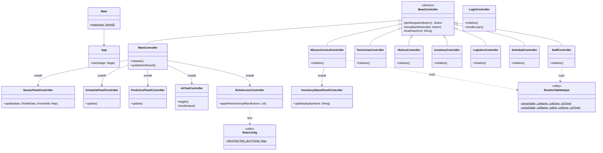
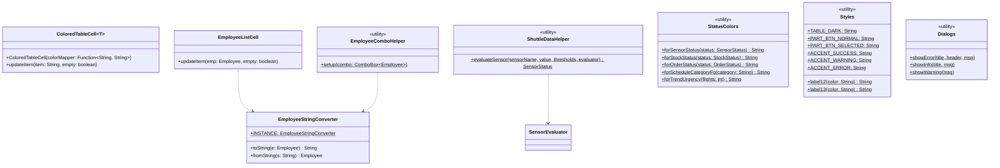

# UML Klassendiagramm — Shuttle Dashboard

**Gruppe 5 · Architekturübersicht**

> Dargestellt: öffentliche, protected und package-private Methoden/Attribute.
> Private Members werden nur gezeigt, wenn sie für das Architekturverständnis unbedingt nötig sind.

---

## Controller-Schicht

---

## Service-Schicht — Interfaces und Implementierungen

```mermaid
classDiagram
    class SensorEvaluator {
        <<interface>>
        +evaluate(value: double, threshold: SensorThreshold) SensorStatus
    }

    class ISensorDataService {
        <<interface>>
        +loadSensorData() ShuttleData
        +loadThresholds() Map
    }

    class IEmployeeService {
        <<interface>>
        +getAllEmployees() List~Employee~
        +getById(id: String) Optional~Employee~
        +getByRole(role: String) List~Employee~
    }

    class IInventoryService {
        <<interface>>
        +loadInventory() List~InventoryItem~
        +saveInventory(items: List)
    }

    class IScheduleService {
        <<interface>>
        +loadSchedule() TakeoverSchedule
    }

    class IFlightHistoryService {
        <<interface>>
        +loadFlightHistory() FlightHistory
    }

    class IPredictiveAnalysisService {
        <<interface>>
        +analyzeAll() Map~String, List~TrendResult~~
    }

    class IPartApproval {
        <<interface>>
        +isPartApproved(partKey: String) boolean
        +canApprove(partKey: String) boolean
        +approve(partKey: String, chiefName: String)
    }

    class IRepairAccess {
        <<interface>>
        +getRepairs(partKey: String) List~RepairTask~
        +allRepairsDone(partKey: String) boolean
        +isTechnicianDone(partKey: String) boolean
        +markTechnicianDone(partKey: String, techName: String)
        +generateRepairs(data, thresholds, evaluator)
    }

    class ITakeoverProgress {
        <<interface>>
        +getProgress() double
        +isTakeoverComplete() boolean
        +getLastActivity() String
    }

    class IWorkerRegistry {
        <<interface>>
        +registerWorker(partKey, name, role)
        +getTechnicianName(partKey: String) String
        +getSecurityChiefName(partKey: String) String
    }

    class IPhaseTracker {
        <<interface>>
        +getAppPhase() AppPhase
        +getRemainingSeconds() int
        +getScheduleStatus() ScheduleStatus
        +beginLanding()
        +setOperational()
        +reset()
    }

    ISensorDataService --|> SensorEvaluator

    class TakeoverState {
        <<Singleton>>
        +getInstance()$ TakeoverState
        +getDisplayName(partKey: String)$ String
        +PART_KEYS: String[]$
        +reset()
    }

    class EmployeeService {
        <<Singleton>>
        +getInstance()$ EmployeeService
        +getAllEmployees() List~Employee~
        +getById(id: String) Optional~Employee~
        +getByTeam(team: String) List~Employee~
    }

    class SensorDataService {
        <<Singleton>>
        +getInstance()$ SensorDataService
        +loadSensorData() ShuttleData
        +loadThresholds() Map
        +evaluate(value: double, t: SensorThreshold) SensorStatus
    }

    class InventoryService {
        <<Singleton>>
        +getInstance()$ InventoryService
        +loadInventory() List~InventoryItem~
        +saveInventory(items: List)
    }

    class ScheduleService {
        <<Singleton>>
        +getInstance()$ ScheduleService
        +loadSchedule() TakeoverSchedule
    }

    class FlightHistoryService {
        <<Singleton>>
        +getInstance()$ FlightHistoryService
        +loadFlightHistory() FlightHistory
    }

    class PredictiveAnalysisService {
        +analyzeAll() Map~String, List~TrendResult~~
    }

    class SessionState {
        <<Singleton>>
        +getInstance()$ SessionState
        +setCurrentUser(e: Employee)
        +getCurrentUser() Employee
        +getCurrentRole() String
        +isLoggedIn() boolean
    }

    class RoutineTaskStore {
        <<Singleton>>
        +getInstance()$ RoutineTaskStore
        +getAllTasks() List~RoutineTask~
        +getTasksForEmployee(empId: String) List~RoutineTask~
        +getTasksForPart(part: String) List~RoutineTask~
        +reset()
    }

    class PhaseTimerService {
        <<Singleton>>
        +getInstance()$ PhaseTimerService
        +start(seconds: int, onTick: Consumer, onComplete: Runnable)
        +stop()
    }

    class AbstractStore~T~ {
        <<abstract>>
        +getAll() List~T~
        +clear()
    }

    class OrderStore {
        <<Singleton>>
        +getInstance()$ OrderStore
        +createOrder(partName, qty, orderedBy, reason) LogisticsOrder
        +getOrders() List~LogisticsOrder~
    }

    class TicketStore {
        <<Singleton>>
        +getInstance()$ TicketStore
        +getTickets() List~MaintenanceTicket~
        +saveTickets(tickets: List)
    }

    TakeoverState ..|> IWorkerRegistry
    TakeoverState ..|> IRepairAccess
    TakeoverState ..|> IPartApproval
    TakeoverState ..|> ITakeoverProgress
    TakeoverState ..|> IPhaseTracker
    EmployeeService ..|> IEmployeeService
    SensorDataService ..|> ISensorDataService
    InventoryService ..|> IInventoryService
    ScheduleService ..|> IScheduleService
    FlightHistoryService ..|> IFlightHistoryService
    PredictiveAnalysisService ..|> IPredictiveAnalysisService
    AbstractStore <|-- OrderStore
    AbstractStore <|-- TicketStore

    PredictiveAnalysisService --> IFlightHistoryService
    PredictiveAnalysisService --> ISensorDataService

    class AiAdvisorService {
        <<utility>>
        +getResponse(message: String)$ String
    }

    class OrderApprovalService {
        <<utility>>
        +approve(order, invService, empService, onDelivered)$
        +reject(order, empService)$
    }

    class RepairInventoryService {
        <<utility>>
        +initTaskStatuses(tasks, inventoryService)$
        +placeOrder(task, inventoryService, onArrived)$
        +deductInventory(task, inventoryService, onDeducted)$
    }

    class MaintenanceHistoryService {
        <<utility>>
        +logRepairs(partKey, repairAccess, workerRegistry)$
    }

    class RepairPlanningService {
        <<utility>>
        +plan(data, thresholds, evaluator, inventoryService)$ Map
    }
```

---

## Controller → Service Abhängigkeiten (Dependency Inversion)

```mermaid
classDiagram
    class LoginController
    class MainController
    class MissionControlController
    class LogisticsController
    class ScheduleController
    class StaffController
    class TechnicianController
    class SensorPanelController
    class SchedulePanelController
    class PredictivePanelController
    class InventoryStatusPanelController

    class IEmployeeService { <<interface>> }
    class ISensorDataService { <<interface>> }
    class IInventoryService { <<interface>> }
    class IScheduleService { <<interface>> }
    class IPredictiveAnalysisService { <<interface>> }
    class IPartApproval { <<interface>> }
    class IRepairAccess { <<interface>> }
    class ITakeoverProgress { <<interface>> }
    class IWorkerRegistry { <<interface>> }
    class IPhaseTracker { <<interface>> }
    class SensorEvaluator { <<interface>> }

    class SessionState { <<Singleton>> }
    class TakeoverState { <<Singleton>> }
    class EmployeeService { <<Singleton>> }
    class SensorDataService { <<Singleton>> }
    class InventoryService { <<Singleton>> }
    class ScheduleService { <<Singleton>> }
    class PredictiveAnalysisService

    TakeoverState ..|> IPartApproval
    TakeoverState ..|> IRepairAccess
    TakeoverState ..|> ITakeoverProgress
    TakeoverState ..|> IWorkerRegistry
    TakeoverState ..|> IPhaseTracker
    EmployeeService ..|> IEmployeeService
    SensorDataService ..|> ISensorDataService
    SensorDataService ..|> SensorEvaluator
    InventoryService ..|> IInventoryService
    ScheduleService ..|> IScheduleService
    PredictiveAnalysisService ..|> IPredictiveAnalysisService

    LoginController --> IEmployeeService
    LoginController --> SessionState
    MainController --> ISensorDataService
    MainController --> IScheduleService
    MainController --> IPhaseTracker
    MainController --> IPartApproval
    MainController --> ITakeoverProgress
    MainController --> IWorkerRegistry
    MainController --> IRepairAccess
    MainController --> IPredictiveAnalysisService
    MainController --> SessionState
    MissionControlController --> IWorkerRegistry
    MissionControlController --> IRepairAccess
    MissionControlController --> IPartApproval
    MissionControlController --> IInventoryService
    MissionControlController --> IScheduleService
    LogisticsController --> IInventoryService
    LogisticsController --> IEmployeeService
    StaffController --> IWorkerRegistry
    StaffController --> IRepairAccess
    ScheduleController --> IScheduleService
    TechnicianController --> ISensorDataService
    SensorPanelController --> SensorEvaluator
    SensorPanelController --> IPartApproval
    SchedulePanelController --> IScheduleService
    SchedulePanelController --> IEmployeeService
    PredictivePanelController --> IPredictiveAnalysisService
    InventoryStatusPanelController --> IInventoryService
```

---

## Util-Schicht

