# UML Class Diagram — Shuttle Dashboard

**Group 5 · Architecture Overview**

> Shown: public, protected and package-private methods/attributes.
> Private members are shown only where necessary for architectural understanding.

---

## Controller Layer

```mermaid
classDiagram
    class Main {
        +main(args: String[])$
    }

    class App {
        +start(stage: Stage)
    }

    class BaseController {
        <<abstract>>
        #getNavigationButton()* Button
        #setupBackButton(btn: Button)
        #loadView(fxml: String)
    }

    class LoginController {
        -employeeService: EmployeeService
        +initialize()
        +handleLogin()
    }

    class MainController {
        -sensorService: ISensorDataService
        -scheduleService: IScheduleService
        -phaseTracker: IPhaseTracker
        -partApproval: IPartApproval
        -takeoverProgress: ITakeoverProgress
        -workerReg: IWorkerRegistry
        -repairAccess: IRepairAccess
        -predictiveService: IPredictiveAnalysisService
        -phaseTimer: PhaseTimerService
        +initialize()
        +loadView(fxml: String)
        +updateDashboard()
    }

    class MissionControlController {
        -workerRegistry: IWorkerRegistry
        -repairAccess: IRepairAccess
        -partApproval: IPartApproval
        -inventoryService: IInventoryService
        -scheduleService: IScheduleService
        +initialize()
    }

    class TechnicianController {
        -sensorService: ISensorDataService
        +initialize()
    }

    class HistoryController {
        -ticketStore: TicketStore
        +initialize()
    }

    class InventoryController {
        -inventoryService: InventoryService
        +initialize()
    }

    class LogisticsController {
        -inventoryService: IInventoryService
        -employeeService: IEmployeeService
        +initialize()
    }

    class ScheduleController {
        -scheduleService: IScheduleService
        +initialize()
        +getInstance()$ ScheduleController
        +refreshSchedule()
    }

    class StaffController {
        -workerRegistry: IWorkerRegistry
        -repairAccess: IRepairAccess
        +initialize()
    }

    Main --> App

    BaseController <|-- MainController
    BaseController <|-- MissionControlController
    BaseController <|-- TechnicianController
    BaseController <|-- HistoryController
    BaseController <|-- InventoryController
    BaseController <|-- LogisticsController
    BaseController <|-- ScheduleController
    BaseController <|-- StaffController

    class SensorPanelController {
        -sensorService: SensorEvaluator
        -partApproval: IPartApproval
        +update(data: ShuttleData, thresholds: Map)
    }

    class SchedulePanelController {
        -scheduleService: IScheduleService
        -employeeService: IEmployeeService
        +update()
    }

    class PredictivePanelController {
        -predictiveService: IPredictiveAnalysisService
        +update()
    }

    class InventoryStatusPanelController {
        -inventoryService: IInventoryService
        +update(displayName: String)
    }

    class AiChatController {
        -userRole: UserRole
        -mainController: MainController
        +setMainController(mc: MainController)
        +setContext(role: UserRole)
        +enableInteraction()
        +handleInput()
    }

    class RoleAccessController {
        -restrictionIds: Map~String, List~
        -buttonLookup: Map~String, Button~
        +applyRestrictions(allNavButtons: List)
    }

    class RoleConfig {
        <<utility>>
        ~RESTRICTED_BUTTONS: Map$
    }

    class RoutineTableHelper {
        <<utility>>
        ~setup(table, colName, colEst, colDone, colTime)$
    }

    class PartStatusCell {
        +updateItem(status: String, empty: boolean)
    }

    class SensorStatusCell {
        +updateItem(item: String, empty: boolean)
    }

    MainController --> SensorPanelController : creates
    MainController --> SchedulePanelController : creates
    MainController --> PredictivePanelController : creates
    MainController --> AiChatController : creates
    MainController --> RoleAccessController : creates
    RoleAccessController ..> RoleConfig : reads
    MissionControlController --> InventoryStatusPanelController : creates
    MissionControlController ..> RoutineTableHelper : uses
    StaffController ..> RoutineTableHelper : uses
    AiChatController --> SessionState : uses
    AiChatController ..> ScheduleService : uses
```

---

## Service Layer — Interfaces and Implementations

```mermaid
classDiagram
    class SensorEvaluator {
        <<interface>>
        +evaluate(value: double, threshold: SensorThreshold) SensorStatus
    }

    class ISensorDataService {
        <<interface>>
        +loadSensorData() ShuttleData
        +loadThresholds() Map
    }

    class IEmployeeService {
        <<interface>>
        +getAllEmployees() List~Employee~
        +getById(id: String) Optional~Employee~
        +getByRole(role: String) List~Employee~
        +getByTeam(team: String) List~Employee~
    }

    class IInventoryService {
        <<interface>>
        +loadInventory() List~InventoryItem~
        +saveInventory(items: List)
    }

    class IScheduleService {
        <<interface>>
        +loadSchedule() TakeoverSchedule
    }

    class IFlightHistoryService {
        <<interface>>
        +loadFlightHistory() FlightHistory
    }

    class IPredictiveAnalysisService {
        <<interface>>
        +analyzeAll() Map~String, List~TrendResult~~
    }

    class IPartApproval {
        <<interface>>
        +isPartApproved(partKey: String) boolean
        +canApprove(partKey: String) boolean
        +approve(partKey: String, chiefName: String)
    }

    class IRepairAccess {
        <<interface>>
        +getRepairs(partKey: String) List~RepairTask~
        +allRepairsDone(partKey: String) boolean
        +isTechnicianDone(partKey: String) boolean
        +markTechnicianDone(partKey: String, techName: String)
        +generateRepairs(data, thresholds, evaluator)
    }

    class ITakeoverProgress {
        <<interface>>
        +getProgress() double
        +isTakeoverComplete() boolean
        +getLastActivity() String
    }

    class IWorkerRegistry {
        <<interface>>
        +registerWorker(partKey, name, role)
        +getWorkerInfo(partKey: String) String
        +getTechnicianName(partKey: String) String
        +getSecurityChiefName(partKey: String) String
    }

    class IPhaseTracker {
        <<interface>>
        +getAppPhase() AppPhase
        +getRemainingSeconds() int
        +getSimulatedHoursElapsed() double
        +getScheduleStatus() ScheduleStatus
        +beginLanding()
        +beginSensorLoading()
        +setOperational()
        +reset()
    }

    ISensorDataService --|> SensorEvaluator

    class TakeoverState {
        <<Singleton>>
        +getInstance()$ TakeoverState
        +getDisplayName(partKey: String)$ String
        +PART_KEYS: String[]$
        +LANDING_SECONDS: int$
        +SENSOR_LOADING_SECONDS: int$
        +reset()
    }

    class EmployeeService {
        <<Singleton>>
        +getInstance()$ EmployeeService
        +getAllEmployees() List~Employee~
        +getById(id: String) Optional~Employee~
        +getByRole(role: String) List~Employee~
        +getByTeam(team: String) List~Employee~
    }

    class SensorDataService {
        <<Singleton>>
        +getInstance()$ SensorDataService
        +loadSensorData() ShuttleData
        +loadThresholds() Map
        +evaluate(value: double, t: SensorThreshold) SensorStatus
    }

    class InventoryService {
        <<Singleton>>
        +getInstance()$ InventoryService
        +loadInventory() List~InventoryItem~
        +saveInventory(items: List)
    }

    class ScheduleService {
        <<Singleton>>
        +getInstance()$ ScheduleService
        +loadSchedule() TakeoverSchedule
    }

    class FlightHistoryService {
        <<Singleton>>
        +getInstance()$ FlightHistoryService
        +loadFlightHistory() FlightHistory
    }

    class PredictiveAnalysisService {
        -flightHistoryService: IFlightHistoryService
        -sensorDataService: ISensorDataService
        +analyzeAll() Map~String, List~TrendResult~~
    }

    class SessionState {
        <<Singleton>>
        -currentUser: Employee
        -currentUserRole: UserRole
        -pendingNotification: boolean
        +getInstance()$ SessionState
        +setCurrentUser(e: Employee)
        +getCurrentUser() Employee
        +setUserRole(role: UserRole)
        +getUserRole() UserRole
        +getCurrentRole() String
        +hasPendingNotification() boolean
        +setPendingNotification(value: boolean)
        +isLoggedIn() boolean
    }

    class RoutineTaskStore {
        <<Singleton>>
        +getInstance()$ RoutineTaskStore
        +getAllTasks() List~RoutineTask~
        +getTasksForEmployee(empId: String) List~RoutineTask~
        +getTasksForPart(part: String) List~RoutineTask~
        +getById(id: String) Optional~RoutineTask~
        +reset()
    }

    class PhaseTimerService {
        <<Singleton>>
        +getInstance()$ PhaseTimerService
        +start(seconds: int, onTick: Consumer, onComplete: Runnable)
        +stop()
    }

    class AbstractStore~T~ {
        <<abstract>>
        #items: List~T~
        +getAll() List~T~
        +clear()
    }

    class OrderStore {
        <<Singleton>>
        +getInstance()$ OrderStore
        +createOrder(partName, qty, orderedBy, reason) LogisticsOrder
        +getOrders() List~LogisticsOrder~
        +clear()
    }

    class TicketStore {
        <<Singleton>>
        +getInstance()$ TicketStore
        +getTickets() List~MaintenanceTicket~
        +saveTickets(tickets: List)
    }

    TakeoverState ..|> IWorkerRegistry
    TakeoverState ..|> IRepairAccess
    TakeoverState ..|> IPartApproval
    TakeoverState ..|> ITakeoverProgress
    TakeoverState ..|> IPhaseTracker
    EmployeeService ..|> IEmployeeService
    SensorDataService ..|> ISensorDataService
    InventoryService ..|> IInventoryService
    ScheduleService ..|> IScheduleService
    FlightHistoryService ..|> IFlightHistoryService
    PredictiveAnalysisService ..|> IPredictiveAnalysisService
    AbstractStore <|-- OrderStore
    AbstractStore <|-- TicketStore

    PredictiveAnalysisService --> IFlightHistoryService
    PredictiveAnalysisService --> ISensorDataService

    class AppPhaseState {
        -appPhase: AppPhase
        -MILESTONES: Map~String, Double~$
        +beginLanding()
        +beginSensorLoading()
        +setOperational()
        +getRemainingSeconds() int
        +getSimulatedHoursElapsed() double
        +getScheduleStatus(approval: IPartApproval) ScheduleStatus
        +reset()
    }

    TakeoverState *-- AppPhaseState

    class AiAdvisorService {
        <<utility>>
        +getResponse(message: String)$ String
    }

    class OrderApprovalService {
        <<utility>>
        +approve(order, invService, empService, onDelivered)$
        +reject(order, empService)$
    }

    class OrderDeliveryService {
        <<utility>>
        +DELIVERY_SECONDS: int$
        +scheduleDelivery(onDelivered: Runnable)$
    }

    class RepairInventoryService {
        <<utility>>
        +initTaskStatuses(tasks, inventoryService)$
        +placeOrder(task, inventoryService, onArrived)$
        +deductInventory(task, inventoryService, onDeducted)$
    }

    class RepairPlanningService {
        <<utility>>
        +plan(data, thresholds, evaluator, inventoryService)$ Map
    }

    class MaintenanceHistoryService {
        <<utility>>
        +logRepairs(partKey, repairAccess, workerRegistry)$
    }

    class SensorStatusAggregator {
        <<utility>>
        +findWorstSensorStatus(data, thresholds, evaluator)$ SensorStatus
    }

    class InventoryStatusCalculator {
        <<utility>>
        +calculate(quantity: int)$ StockStatus
    }

    class TrendCalculator {
        <<utility>>
        +computeFlightsUntilLimit(current, trend, threshold)$ int
        +buildRecommendation(sensor, trend, direction, flights)$ String
    }

    class LogisticsOrderService {
        <<utility>>
        +approve(order, chief)$
        +reject(order, chief)$
        +markOrdered(order)$
        +markDelivered(order)$
    }

    TakeoverState ..> RepairPlanningService
    OrderApprovalService ..> OrderDeliveryService
    OrderApprovalService ..> LogisticsOrderService
    RepairInventoryService ..> OrderDeliveryService
```

---

## Controller → Service Dependencies (Dependency Inversion)

```mermaid
classDiagram
    class LoginController
    class MainController
    class MissionControlController
    class LogisticsController
    class ScheduleController
    class StaffController
    class TechnicianController
    class SensorPanelController
    class SchedulePanelController
    class PredictivePanelController
    class InventoryStatusPanelController
    class AiChatController

    class IEmployeeService { <<interface>> }
    class ISensorDataService { <<interface>> }
    class IInventoryService { <<interface>> }
    class IScheduleService { <<interface>> }
    class IPredictiveAnalysisService { <<interface>> }
    class IPartApproval { <<interface>> }
    class IRepairAccess { <<interface>> }
    class ITakeoverProgress { <<interface>> }
    class IWorkerRegistry { <<interface>> }
    class IPhaseTracker { <<interface>> }
    class SensorEvaluator { <<interface>> }

    class SessionState { <<Singleton>> }
    class TakeoverState { <<Singleton>> }
    class EmployeeService { <<Singleton>> }
    class SensorDataService { <<Singleton>> }
    class InventoryService { <<Singleton>> }
    class ScheduleService { <<Singleton>> }
    class PredictiveAnalysisService

    TakeoverState ..|> IPartApproval
    TakeoverState ..|> IRepairAccess
    TakeoverState ..|> ITakeoverProgress
    TakeoverState ..|> IWorkerRegistry
    TakeoverState ..|> IPhaseTracker
    EmployeeService ..|> IEmployeeService
    SensorDataService ..|> ISensorDataService
    SensorDataService ..|> SensorEvaluator
    InventoryService ..|> IInventoryService
    ScheduleService ..|> IScheduleService
    PredictiveAnalysisService ..|> IPredictiveAnalysisService

    LoginController --> IEmployeeService
    LoginController --> SessionState
    MainController --> ISensorDataService
    MainController --> IScheduleService
    MainController --> IPhaseTracker
    MainController --> IPartApproval
    MainController --> ITakeoverProgress
    MainController --> IWorkerRegistry
    MainController --> IRepairAccess
    MainController --> IPredictiveAnalysisService
    MainController --> SessionState
    MissionControlController --> IWorkerRegistry
    MissionControlController --> IRepairAccess
    MissionControlController --> IPartApproval
    MissionControlController --> IInventoryService
    MissionControlController --> IScheduleService
    LogisticsController --> IInventoryService
    LogisticsController --> IEmployeeService
    StaffController --> IWorkerRegistry
    StaffController --> IRepairAccess
    ScheduleController --> IScheduleService
    ScheduleController --> EmployeeService
    TechnicianController --> ISensorDataService
    SensorPanelController --> SensorEvaluator
    SensorPanelController --> IPartApproval
    SchedulePanelController --> IScheduleService
    SchedulePanelController --> IEmployeeService
    PredictivePanelController --> IPredictiveAnalysisService
    InventoryStatusPanelController --> IInventoryService
    AiChatController --> SessionState
    AiChatController --> ScheduleService
```

---

## Utility Layer

```mermaid
classDiagram
    class ColoredTableCell~T~ {
        -colorMapper: Function~String, String~
        +ColoredTableCell(colorMapper: Function~String, String~)
        +updateItem(item: String, empty: boolean)
    }

    class EmployeeStringConverter {
        +INSTANCE: EmployeeStringConverter$
        -employeeService: IEmployeeService
        +toString(e: Employee) String
        +fromString(s: String) Employee
    }

    class EmployeeListCell {
        +updateItem(emp: Employee, empty: boolean)
    }

    class EmployeeComboHelper {
        <<utility>>
        +setup(combo: ComboBox~Employee~)$
    }

    class ShuttleDataHelper {
        <<utility>>
        +evaluateSensor(sensorName, value, thresholds, evaluator)$ SensorStatus
    }

    class StatusColors {
        <<utility>>
        +forSensorStatus(status: SensorStatus)$ String
        +forSensorStatus(status: String)$ String
        +forStockStatus(status: StockStatus)$ String
        +forStockStatus(status: String)$ String
        +forOrderStatus(status: OrderStatus)$ String
        +forOrderStatus(status: String)$ String
        +forTrendUrgency(flights: int)$ String
        +forScheduleCategoryBg(category: String)$ String
        +forScheduleCategoryFg(category: String)$ String
    }

    class Styles {
        <<utility>>
        +TABLE_DARK: String$
        +NAV_BTN_NORMAL: String$
        +NAV_BTN_HOVER: String$
        +PART_BTN_NORMAL: String$
        +PART_BTN_SELECTED: String$
        +ACCENT_SUCCESS: String$
        +ACCENT_WARNING: String$
        +ACCENT_ERROR: String$
        +label12(color: String)$ String
        +label13(color: String)$ String
        +label16(color: String)$ String
        +labelBold16(color: String)$ String
    }

    class Dialogs {
        <<utility>>
        +showError(title, header, msg)$
        +showInfo(title, msg)$
        +showWarning(msg)$
    }

    EmployeeListCell ..> EmployeeStringConverter : uses
    EmployeeComboHelper ..> EmployeeStringConverter : uses
    EmployeeComboHelper ..> EmployeeService : calls getInstance()
    ShuttleDataHelper ..> SensorEvaluator : uses
```

