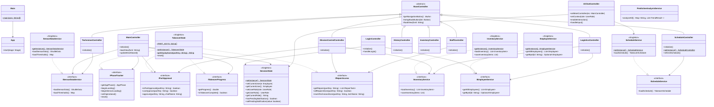

# UML Class Diagram — Simplified

**Group 5 · Architecture Overview for Review**

> Only public / protected / package-private members. Private only where necessary.

---

```mermaid
classDiagram
    direction TB

    %% ── Entry Point ──────────────────────────────────────────────
    class Main {
        +main(args: String[])$
    }
    class App {
        +start(stage: Stage)
    }
    Main --> App

    %% ── Controller Layer ────────────────────────────────────
    class BaseController {
        <<abstract>>
        #getNavigationButton()* Button
        #setupBackButton(btn: Button)
        #loadView(fxml: String)
    }

    class LoginController {
        +initialize()
        +handleLogin()
    }

    class MainController {
        +initialize()
        +loadView(fxml: String)
        +updateDashboard()
    }

    class MissionControlController {
        +initialize()
    }

    class TechnicianController {
        +initialize()
    }

    class LogisticsController {
        +initialize()
    }

    class ScheduleController {
        +initialize()
        +getInstance()$ ScheduleController
        +refreshSchedule()
    }

    class StaffController {
        +initialize()
    }

    class HistoryController {
        +initialize()
    }

    class InventoryController {
        +initialize()
    }

    class AiChatController {
        +setMainController(mc: MainController)
        +setContext(role: UserRole)
        +enableInteraction()
        +handleInput()
    }

    BaseController <|-- MainController
    BaseController <|-- MissionControlController
    BaseController <|-- TechnicianController
    BaseController <|-- LogisticsController
    BaseController <|-- ScheduleController
    BaseController <|-- StaffController
    BaseController <|-- HistoryController
    BaseController <|-- InventoryController

    %% ── Service Interfaces ────────────────────────────────────
    class ISensorDataService {
        <<interface>>
        +loadSensorData() ShuttleData
        +loadThresholds() Map
    }

    class IEmployeeService {
        <<interface>>
        +getAllEmployees() List~Employee~
        +getById(id: String) Optional~Employee~
    }

    class IInventoryService {
        <<interface>>
        +loadInventory() List~InventoryItem~
        +saveInventory(items: List)
    }

    class IScheduleService {
        <<interface>>
        +loadSchedule() TakeoverSchedule
    }

    class IPartApproval {
        <<interface>>
        +isPartApproved(partKey: String) boolean
        +canApprove(partKey: String) boolean
        +approve(partKey: String, chiefName: String)
    }

    class IRepairAccess {
        <<interface>>
        +getRepairs(partKey: String) List~RepairTask~
        +allRepairsDone(partKey: String) boolean
        +markTechnicianDone(partKey: String, techName: String)
    }

    class ITakeoverProgress {
        <<interface>>
        +getProgress() double
        +isTakeoverComplete() boolean
    }

    class IPhaseTracker {
        <<interface>>
        +getAppPhase() AppPhase
        +beginLanding()
        +beginSensorLoading()
        +setOperational()
        +reset()
    }

    %% ── Service Implementations ─────────────────────────────
    class TakeoverState {
        <<Singleton>>
        +getInstance()$ TakeoverState
        +PART_KEYS: String[]$
        +getDisplayName(partKey: String)$ String
        +reset()
    }

    class SessionState {
        <<Singleton>>
        +getInstance()$ SessionState
        +setCurrentUser(e: Employee)
        +getCurrentUser() Employee
        +setUserRole(role: UserRole)
        +getUserRole() UserRole
        +getCurrentRole() String
        +hasPendingNotification() boolean
        +setPendingNotification(value: boolean)
    }

    class SensorDataService {
        <<Singleton>>
        +getInstance()$ SensorDataService
        +loadSensorData() ShuttleData
        +loadThresholds() Map
    }

    class EmployeeService {
        <<Singleton>>
        +getInstance()$ EmployeeService
        +getAllEmployees() List~Employee~
        +getById(id: String) Optional~Employee~
    }

    class InventoryService {
        <<Singleton>>
        +getInstance()$ InventoryService
        +loadInventory() List~InventoryItem~
        +saveInventory(items: List)
    }

    class ScheduleService {
        <<Singleton>>
        +getInstance()$ ScheduleService
        +loadSchedule() TakeoverSchedule
    }

    class PredictiveAnalysisService {
        +analyzeAll() Map~String, List~TrendResult~~
    }

    TakeoverState ..|> IPartApproval
    TakeoverState ..|> IRepairAccess
    TakeoverState ..|> ITakeoverProgress
    TakeoverState ..|> IPhaseTracker
    SensorDataService ..|> ISensorDataService
    EmployeeService ..|> IEmployeeService
    InventoryService ..|> IInventoryService
    ScheduleService ..|> IScheduleService

    %% ── Controllers use Interfaces (Dependency Inversion) ────
    LoginController --> IEmployeeService
    LoginController --> SessionState
    MainController --> ISensorDataService
    MainController --> IPhaseTracker
    MainController --> IPartApproval
    MainController --> ITakeoverProgress
    MainController --> SessionState
    MissionControlController --> IRepairAccess
    MissionControlController --> IPartApproval
    MissionControlController --> IInventoryService
    LogisticsController --> IInventoryService
    LogisticsController --> IEmployeeService
    TechnicianController --> ISensorDataService
    ScheduleController --> IScheduleService
    StaffController --> IRepairAccess
    AiChatController --> SessionState
    AiChatController --> ScheduleService
```
